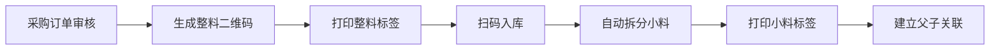
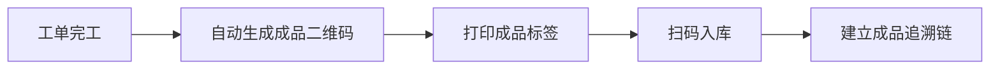

# 二维码全流程追溯系统 详细设计

> 文档编号：VNERP-DESIGN-001  
> 版本：V1.0  
> 更新日期：2026-05-10

---

## 1. 系统概述

### 1.1 设计目标

二维码全流程追溯系统是 VNERP 的核心基础设施，实现从原材料采购到成品销售的完整追溯链条。系统针对丝网印刷行业特点，特别强化小料拆分追溯能力，确保每个小料单元都可追溯到原始整料批次。

### 1.2 核心能力

- **一物一码**：每个物料单元（整料/小料/余料/成品）都有唯一二维码
- **全程追溯**：原料→批次→生产→成品→发货的完整链路
- **小料追溯**：支持整料拆分小料后的精准追溯
- **扫码优先**：所有业务环节通过扫码完成，减少人工录入错误

---

## 2. 二维码生成规则

### 2.1 编码结构

```
前缀(2位) + 类型(1位) + 时间戳(8位) + 序列号(7位) + 拆分标识(1位)
```

| 字段 | 长度 | 说明 |
|------|------|------|
| 前缀 | 2位 | VN=越南大昌，固定标识 |
| 类型 | 1位 | R=原材料，F=成品，W=工单，S=销售订单 |
| 时间戳 | 8位 | YYYYMMDD 格式 |
| 序列号 | 7位 | 当日序号，0000001-9999999 |
| 拆分标识 | 1位 | 0=整料，1=小料，2=余料 |

### 2.2 编码示例

| 二维码 | 说明 |
|--------|------|
| `VNR2026051000000010` | 2026-05-10 第1个整料批次 |
| `VNR2026051000000011` | 上述整料拆分的小料 |
| `VNR2026051000000012` | 上述整料拆分的余料 |
| `VNF2026051000000010` | 2026-05-10 第1个成品 |

### 2.3 二维码类型定义

| 类型代码 | 类型名称 | 拆分标识 | 说明 |
|----------|----------|----------|------|
| R | 原材料 | 0 | 整料批次，采购入库时生成 |
| R | 原材料 | 1 | 小料，整料拆分后生成 |
| R | 原材料 | 2 | 余料，拆分剩余生成 |
| F | 成品 | 0 | 成品，生产完工时生成 |
| W | 工单 | - | 生产工单标识 |
| S | 销售订单 | - | 销售订单标识 |

---

## 3. 全流程追溯详细设计

### 3.1 原材料入库环节



**详细流程：**

1. **采购订单审核通过后**，系统自动为每个物料批次生成唯一的整料二维码（拆分标识为 0）
2. **仓库人员打印整料二维码标签**并粘贴到整料包装上
3. **扫码整料二维码入库**，系统记录入库信息
4. **系统自动拆分小料**：根据 `material_split_configs` 预设的标准拆分单位，生成对应数量的小料二维码（拆分标识为 1）
5. **仓库人员打印小料二维码标签**并粘贴到每个小料单元上
6. **系统建立整料二维码与小料二维码的父子关联关系**（`qr_codes.parent_id`）

### 3.2 生产领料环节


**详细流程：**

1. **工单审核通过并下发后**，系统根据 BOM 自动生成领料单
2. **系统自动计算所需小料数量**，并根据先进先出原则推荐小料批次
3. **仓库人员根据推荐批次准备小料**
4. **扫描小料二维码进行出库**，系统校验：
   - 二维码是否有效
   - 是否已出库
   - 是否为推荐的先进先出批次
5. **系统自动记录**：工单编号、小料二维码、领用数量、领用时间、操作人员
6. **建立工单与小料二维码的关联关系**
7. **小料领用后，系统自动更新整料的剩余数量**

### 3.3 生产报工环节


**详细流程：**

1. **生产人员扫描工单二维码**，系统显示该工单关联的标准卡
2. **扫描小料二维码进行投料**，系统记录：
   - 工单编号
   - 工序编号
   - 小料二维码
   - 投料数量
   - 投料时间
3. **生产人员按照标准卡参数进行生产**，记录实际工艺参数
4. **工序报工时**，系统自动关联投料的小料二维码

### 3.4 成品入库环节



**详细流程：**

1. **工单完工后**，系统自动生成成品二维码（类型 F，拆分标识 0）
2. **打印成品二维码标签**并粘贴到成品包装上
3. **扫码成品二维码入库**，系统记录入库信息
4. **系统自动建立成品追溯链**：
   - 成品二维码 → 工单编号
   - 工单编号 → 投料小料二维码列表
   - 小料二维码 → 整料批次
   - 整料批次 → 采购订单/供应商

### 3.5 销售发货环节


**详细流程：**

1. **销售订单审核通过后**，系统自动生成发货单
2. **系统根据成品先进先出原则推荐发货批次**
3. **仓库人员扫描成品二维码进行出库**，系统校验：
   - 二维码是否有效
   - 是否已发货
   - 是否为推荐的先进先出批次
4. **系统自动建立成品与销售订单、客户的关联关系**
5. **生成完整的追溯记录**，实现从客户到原材料的反向追溯

### 3.6 追溯查询环节

#### 3.6.1 小料追溯（正向追溯）

```
输入小料二维码 → 查询对应的整料批次 → 查询供应商信息 → 查询使用该小料的工单 → 查询成品
```

**API 端点：** `POST /api/qrcode/trace`

**请求参数：**
```json
{
  "qr_code": "VNR2026051000000011"
}
```

**响应示例：**
```json
{
  "code": 200,
  "message": "success",
  "data": {
    "qr_code": "VNR2026051000000011",
    "type": "原材料",
    "split_flag": "小料",
    "parent": {
      "qr_code": "VNR2026051000000010",
      "type": "原材料",
      "split_flag": "整料",
      "batch_no": "RM20260510001",
      "supplier": "XX供应商",
      "inbound_date": "2026-05-10"
    },
    "work_orders": [
      {
        "work_order_no": "WO202605100001",
        "product_name": "丝网印刷产品A",
        "quantity": 5,
        "issue_date": "2026-05-11"
      }
    ],
    "finished_products": [
      {
        "qr_code": "VNF2026051000000010",
        "product_name": "丝网印刷产品A",
        "quantity": 100,
        "receipt_date": "2026-05-12"
      }
    ]
  }
}
```

#### 3.6.2 整料追溯（批次追溯）

```
输入整料二维码 → 查询所有拆分的小料二维码 → 查询每个小料的领用情况 → 查询对应的工单和成品
```

#### 3.6.3 成品追溯（反向追溯）

```
输入成品二维码 → 查询生产工单 → 查询投料小料列表 → 查询整料批次 → 查询供应商
```

#### 3.6.4 客户追溯（质量追溯）

```
输入客户名称/销售订单 → 查询所有发货成品 → 查询生产工单 → 查询投料小料 → 查询整料批次
```

---

## 4. 数据结构设计

### 4.1 二维码主表（qr_codes）

| 字段名 | 类型 | 说明 |
|--------|------|------|
| id | bigint | 主键 |
| qr_code | varchar(20) | 二维码编码，唯一 |
| type | varchar(1) | 类型：R=原材料，F=成品，W=工单，S=销售订单 |
| split_flag | smallint | 拆分标识：0=整料，1=小料，2=余料 |
| parent_id | bigint | 父二维码 ID（小料和余料关联整料） |
| material_id | bigint | 关联物料 ID |
| batch_no | varchar(50) | 批次号 |
| quantity | decimal(10,2) | 数量 |
| unit | varchar(10) | 单位 |
| warehouse_id | bigint | 仓库 ID |
| warehouse_location | varchar(50) | 库位 |
| status | smallint | 状态：0=未使用，1=已使用，2=已冻结 |
| inbound_date | datetime | 入库时间 |
| expiry_date | date | 效期 |
| create_time | datetime | 创建时间 |
| update_time | datetime | 更新时间 |

### 4.2 二维码追溯记录表（qrcode_record）

| 字段名 | 类型 | 说明 |
|--------|------|------|
| id | bigint | 主键 |
| qr_code | varchar(20) | 二维码编码 |
| type | varchar(20) | 记录类型：入库/出库/投料/报工/发货 |
| ref_type | varchar(50) | 关联单据类型 |
| ref_id | bigint | 关联单据 ID |
| ref_no | varchar(50) | 关联单据编号 |
| quantity | decimal(10,2) | 数量 |
| operator_id | bigint | 操作人员 ID |
| operator_name | varchar(50) | 操作人员姓名 |
| create_time | datetime | 记录时间 |
| remark | text | 备注 |

### 4.3 整料小料关联表（material_splits）

| 字段名 | 类型 | 说明 |
|--------|------|------|
| id | bigint | 主键 |
| parent_qr_code | varchar(20) | 整料二维码 |
| child_qr_code | varchar(20) | 小料/余料二维码 |
| split_type | smallint | 拆分类型：1=小料，2=余料 |
| split_quantity | decimal(10,2) | 拆分数量 |
| split_unit | varchar(10) | 拆分单位 |
| create_time | datetime | 拆分时间 |
| operator_id | bigint | 操作人员 ID |

---

## 5. 核心接口设计

### 5.1 生成二维码

```http
POST /api/qrcode/generate
Content-Type: application/json
Authorization: Bearer {token}

{
  "type": "R",
  "material_id": 1,
  "quantity": 100,
  "unit": "米",
  "warehouse_id": 1
}
```

### 5.2 批量生成小料二维码

```http
POST /api/qrcode/split
Content-Type: application/json
Authorization: Bearer {token}

{
  "parent_qr_code": "VNR2026051000000010",
  "split_qty": 10,
  "split_unit": "米"
}
```

### 5.3 追溯查询

```http
POST /api/qrcode/trace
Content-Type: application/json
Authorization: Bearer {token}

{
  "qr_code": "VNR2026051000000011"
}
```

### 5.4 扫码验证

```http
POST /api/qrcode/verify
Content-Type: application/json
Authorization: Bearer {token}

{
  "qr_code": "VNR2026051000000011",
  "action": "出库"
}
```

---

## 6. 与其他模块的集成

| 模块 | 集成点 |
|------|--------|
| 采购管理 | 采购入库时自动生成整料二维码 |
| 仓库管理 | 出入库时扫码验证和记录 |
| 生产管理 | 工单关联二维码，投料记录 |
| 品质管理 | 检验记录关联二维码 |
| 销售管理 | 发货时扫码出库，建立客户关联 |
| 财务管理 | 成本核算时获取二维码关联的批次成本 |

---

## 7. 异常处理

| 异常场景 | 处理方式 |
|----------|----------|
| 二维码重复 | 系统提示"该二维码已存在"，禁止重复生成 |
| 二维码无效 | 系统提示"无效的二维码"，禁止操作 |
| 二维码已使用 | 系统提示"该物料已出库/已发货"，禁止重复操作 |
| 整料未拆分 | 系统提示"整料未拆分，请先拆分小料"，禁止直接领用 |
| 小料不足 | 系统提示"小料库存不足"，建议拆分新的整料 |
| 追溯链断裂 | 系统标记异常，通知管理员核查 |

---

## 8. 报表统计

- **二维码使用情况报表**：统计各类二维码的生成和使用情况
- **追溯查询统计报表**：统计追溯查询的次数和类型
- **物料流向分析报表**：分析物料从入库到出库的流向
- **批次追溯效率报表**：统计批次追溯的平均时间和成功率
