# 二维码全流程追溯系统 详细设计

> 文档编号：VNERP-DESIGN-001
> 版本：V1.1
> 更新日期：2026-05-12

---

## 1. 系统概述

### 1.1 设计目标

二维码全流程追溯系统是 VNERP 的核心基础设施，实现从原材料采购到成品销售的完整追溯链条。系统针对丝网印刷行业特点，特别强化小料拆分追溯能力，确保每个小料单元都可追溯到原始整料批次。

### 1.2 核心能力

- **一物一码**：每个物料单元（整料/小料/余料/成品）都有唯一二维码
- **全程追溯**：原料→批次→生产→成品→发货的完整链路
- **小料追溯**：支持整料拆分小料后的精准追溯
- **扫码优先**：所有业务环节通过扫码完成，减少人工录入错误
- **标签打印**：支持多种规格标签模板，对接主流条码打印机

---

## 2. 二维码生成规则

### 2.1 编码结构

```
前缀(2位) + 类型(1位) + 时间戳(8位) + 序列号(7位) + 拆分标识(1位)
```

| 字段 | 长度 | 说明 |
|------|------|------|
| 前缀 | 2位 | VN=越南大昌，固定标识 |
| 类型 | 1位 | R=原材料，F=成品，W=工单，S=销售订单 |
| 时间戳 | 8位 | YYYYMMDD 格式 |
| 序列号 | 7位 | 当日序号，0000001-9999999 |
| 拆分标识 | 1位 | 0=整料，1=小料，2=余料 |

### 2.2 编码示例

| 二维码 | 说明 |
|--------|------|
| `VNR2026051000000010` | 2026-05-10 第1个整料批次 |
| `VNR2026051000000011` | 上述整料拆分的小料 |
| `VNR2026051000000012` | 上述整料拆分的余料 |
| `VNF2026051000000010` | 2026-05-10 第1个成品 |

### 2.3 二维码类型定义

| 类型代码 | 类型名称 | 拆分标识 | 说明 |
|----------|----------|----------|------|
| R | 原材料 | 0 | 整料批次，采购入库时生成 |
| R | 原材料 | 1 | 小料，整料拆分后生成 |
| R | 原材料 | 2 | 余料，拆分剩余生成 |
| F | 成品 | 0 | 成品，生产完工时生成 |
| W | 工单 | - | 生产工单标识 |
| S | 销售订单 | - | 销售订单标识 |

---

## 3. 二维码标签打印系统

### 3.1 标签模板设计

#### 3.1.1 标签规格定义

| 规格代码 | 尺寸(宽x高) | 适用场景 | 打印机类型 |
|----------|-------------|----------|------------|
| L-50x30 | 50mm x 30mm | 小料标签、余料标签 | 热敏/热转印 |
| L-60x40 | 60mm x 40mm | 标准物料标签 | 热敏/热转印 |
| L-80x60 | 80mm x 60mm | 整料标签、成品标签 | 热转印 |
| L-100x80 | 100mm x 80mm | 大件成品标签、托盘标签 | 热转印 |
| L-40x20 | 40mm x 20mm | 网版标签、刀模标签 | 热敏 |

#### 3.1.2 标签内容布局

**标准物料标签 (L-60x40)**：

```
┌────────────────────────────┐
│  [二维码图像]  物料名称     │
│  VNR2026051000000010       │
│  批次: RM20260510001       │
│  数量: 100 米              │
│  供应商: XX供应商          │
│  入库: 2026-05-10          │
└────────────────────────────┘
```

**小料标签 (L-50x30)**：

```
┌──────────────────────┐
│  [二维码图像]        │
│  VNR2026051000000011 │
│  小料: 10 米         │
│  父批次: RM20260510001│
└──────────────────────┘
```

**成品标签 (L-80x60)**：

```
┌────────────────────────────────────┐
│  [二维码图像]        成品标签      │
│  VNF2026051000000010               │
│  产品: 丝网印刷产品A               │
│  工单: WO202605100001              │
│  数量: 100 PCS                     │
│  完工: 2026-05-12  质检: 合格      │
└────────────────────────────────────┘
```

### 3.2 标签打印控件设计

#### 3.2.1 前端打印组件架构

```typescript
// components/qr-code/QRCodeLabelPrinter.tsx
interface QRCodeLabelPrinterProps {
  qrCode: string;           // 二维码内容
  labelType: LabelType;     // 标签类型
  printData: PrintData;     // 打印数据
  printerConfig?: PrinterConfig; // 打印机配置
}

interface PrintData {
  title?: string;           // 标题
  materialName?: string;    // 物料名称
  batchNo?: string;         // 批次号
  quantity?: number;        // 数量
  unit?: string;            // 单位
  supplier?: string;        // 供应商
  workOrderNo?: string;     // 工单号
  productName?: string;     // 产品名称
  operator?: string;        // 操作员
  date?: string;            // 日期
  extraFields?: Record<string, string>; // 扩展字段
}

interface PrinterConfig {
  printerName: string;      // 打印机名称
  labelWidth: number;       // 标签宽度(mm)
  labelHeight: number;      // 标签高度(mm)
  dpi: number;              // 打印分辨率
  orientation: 'portrait' | 'landscape';
}
```

#### 3.2.2 打印方式支持

| 打印方式 | 技术方案 | 适用场景 | 优缺点 |
|----------|----------|----------|--------|
| 浏览器原生打印 | window.print() + CSS @media print | 普通A4纸打印 | 简单通用，精度低 |
| WebUSB 直连 | WebUSB API + ESC/POS 指令 | USB热敏打印机 | 实时性好，需浏览器支持 |
| 打印服务中间件 | Node.js 打印服务 + Socket | 工业条码打印机 | 功能强大，需部署服务 |
| PDF生成下载 | jsPDF / react-pdf | 批量打印、预览 | 跨平台，非实时 |
| 云打印 | 打印任务队列 + 本地代理 | 多打印机管理 | 集中管理，架构复杂 |

**推荐方案（混合架构）**：
- **开发/测试环境**：PDF生成预览 + 浏览器打印
- **生产环境**：打印服务中间件（Windows）或 CUPS（Linux）
- **PDA/移动端**：蓝牙打印机 ESC/POS 指令

#### 3.2.3 打印服务中间件设计

```typescript
// lib/print-service.ts
export class PrintService {
  // 发送打印任务到本地打印服务
  async printLabel(task: PrintTask): Promise<PrintResult> {
    const response = await fetch('http://localhost:9100/print', {
      method: 'POST',
      headers: { 'Content-Type': 'application/json' },
      body: JSON.stringify(task),
    });
    return response.json();
  }

  // 生成 ZPL 指令（Zebra 打印机）
  generateZPL(data: PrintData, config: PrinterConfig): string {
    return `
      ^XA
      ^FO50,50^BQN,2,5^FD${data.qrCode}^FS
      ^FO200,50^A0N,30,30^FD${data.materialName}^FS
      ^FO200,100^A0N,20,20^FD${data.qrCode}^FS
      ^FO200,140^A0N,20,20^FDBatch: ${data.batchNo}^FS
      ^FO200,180^A0N,20,20^FDQty: ${data.quantity} ${data.unit}^FS
      ^XZ
    `;
  }

  // 生成 TSPL 指令（TSC 打印机）
  generateTSPL(data: PrintData, config: PrinterConfig): string {
    return `
      SIZE ${config.labelWidth} mm, ${config.labelHeight} mm
      GAP 2 mm, 0
      DIRECTION 1
      CLS
      QRCODE 50,50,L,5,A,0,"${data.qrCode}"
      TEXT 200,50,"TSS24.BF2",0,1,1,"${data.materialName}"
      TEXT 200,100,"TSS24.BF2",0,1,1,"${data.qrCode}"
      TEXT 200,150,"TSS24.BF2",0,1,1,"Batch: ${data.batchNo}"
      PRINT 1
    `;
  }
}
```

### 3.3 各模块标签打印集成点

#### 3.3.1 采购入库模块

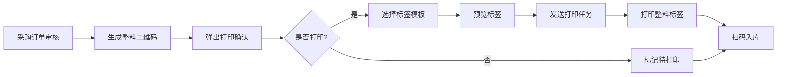

**UI 集成位置**：
- 采购入库单详情页 → "打印标签" 按钮
- 批量入库 → "批量打印标签" 功能
- 入库完成提示 → "是否立即打印标签?"

**打印数据**：
```json
{
  "qrCode": "VNR2026051000000010",
  "materialName": "黄色丝印油墨",
  "batchNo": "RM20260510001",
  "quantity": 100,
  "unit": "KG",
  "supplier": "XX化工有限公司",
  "date": "2026-05-10"
}
```

#### 3.3.2 仓库管理模块

**小料拆分打印**：

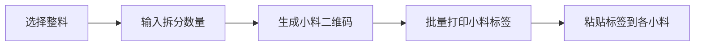

**UI 集成位置**：
- 库存详情 → "拆分小料" 按钮 → 拆分完成后自动弹出打印
- 小料管理 → "补打标签" 功能（标签损坏时）

**余料打印**：
- 领料后剩余 → 自动生成余料二维码 → 打印余料标签

#### 3.3.3 生产管理模块

**工单标签打印**：

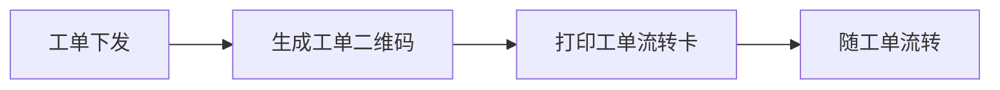

**UI 集成位置**：
- 工单详情 → "打印流转卡" 按钮
- 生产看板 → 批量打印今日工单

**流转卡内容**：
```
┌────────────────────────────────────┐
│  生产流转卡                        │
│  [工单二维码]                      │
│  工单: WO202605100001              │
│  产品: 丝网印刷产品A               │
│  数量: 1000 PCS                    │
│  工序: 印刷→烘干→质检→包装       │
│  计划: 2026-05-10 ~ 2026-05-12    │
└────────────────────────────────────┘
```

#### 3.3.4 成品入库模块

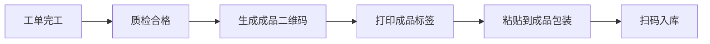

**UI 集成位置**：
- 报工完成 → "打印成品标签" 按钮
- 成品入库单 → "批量打印标签"

#### 3.3.5 销售发货模块

**发货标签打印**：

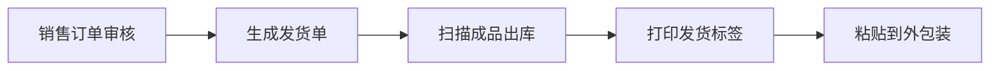

**发货标签内容**：
```
┌────────────────────────────────────┐
│  发货标签                          │
│  [发货单二维码]                    │
│  订单: SO202605100001              │
│  客户: ABC有限公司                 │
│  件数: 5/10                        │
│  地址: 越南胡志明市...             │
│  日期: 2026-05-12                  │
└────────────────────────────────────┘
```

### 3.4 标签打印组件详细设计

#### 3.4.1 React 打印组件

```tsx
// components/qr-code/LabelPrintButton.tsx
'use client';

import { useState } from 'react';
import { Button } from '@/components/ui/button';
import { Printer, Eye } from 'lucide-react';
import { LabelPreviewDialog } from './LabelPreviewDialog';
import { PrintConfigDialog } from './PrintConfigDialog';
import { printService } from '@/lib/print-service';

interface LabelPrintButtonProps {
  qrCode: string;
  labelType: 'material' | 'small' | 'finished' | 'shipping' | 'workorder';
  data: PrintData;
  variant?: 'default' | 'outline' | 'ghost';
  size?: 'default' | 'sm' | 'lg' | 'icon';
}

export function LabelPrintButton({
  qrCode,
  labelType,
  data,
  variant = 'outline',
  size = 'sm'
}: LabelPrintButtonProps) {
  const [previewOpen, setPreviewOpen] = useState(false);
  const [configOpen, setConfigOpen] = useState(false);
  const [isPrinting, setIsPrinting] = useState(false);

  const handlePrint = async (config: PrinterConfig) => {
    setIsPrinting(true);
    try {
      const result = await printService.printLabel({
        qrCode,
        labelType,
        data,
        config,
      });
      if (result.success) {
        toast.success('打印任务已发送');
      } else {
        toast.error(`打印失败: ${result.message}`);
      }
    } catch (error) {
      toast.error('打印服务连接失败');
    } finally {
      setIsPrinting(false);
      setConfigOpen(false);
    }
  };

  return (
    <>
      <div className="flex gap-2">
        <Button
          variant="outline"
          size="sm"
          onClick={() => setPreviewOpen(true)}
        >
          <Eye className="h-4 w-4 mr-1" />
          预览
        </Button>
        <Button
          variant={variant}
          size={size}
          onClick={() => setConfigOpen(true)}
          disabled={isPrinting}
        >
          <Printer className="h-4 w-4 mr-1" />
          {isPrinting ? '打印中...' : '打印标签'}
        </Button>
      </div>

      <LabelPreviewDialog
        open={previewOpen}
        onClose={() => setPreviewOpen(false)}
        qrCode={qrCode}
        labelType={labelType}
        data={data}
      />

      <PrintConfigDialog
        open={configOpen}
        onClose={() => setConfigOpen(false)}
        onConfirm={handlePrint}
        labelType={labelType}
      />
    </>
  );
}
```

#### 3.4.2 标签预览组件

```tsx
// components/qr-code/LabelPreviewDialog.tsx
import { Dialog, DialogContent, DialogHeader, DialogTitle } from '@/components/ui/dialog';
import { QRCodeSVG } from 'qrcode.react';

interface LabelPreviewDialogProps {
  open: boolean;
  onClose: () => void;
  qrCode: string;
  labelType: string;
  data: PrintData;
}

export function LabelPreviewDialog({ open, onClose, qrCode, labelType, data }: LabelPreviewDialogProps) {
  const labelTemplates = {
    material: { width: 240, height: 160, title: '物料标签' },
    small: { width: 200, height: 120, title: '小料标签' },
    finished: { width: 320, height: 240, title: '成品标签' },
    shipping: { width: 400, height: 300, title: '发货标签' },
    workorder: { width: 400, height: 200, title: '流转卡' },
  };

  const template = labelTemplates[labelType] || labelTemplates.material;

  return (
    <Dialog open={open} onOpenChange={onClose}>
      <DialogContent className="max-w-md">
        <DialogHeader>
          <DialogTitle>标签预览 - {template.title}</DialogTitle>
        </DialogHeader>
        <div
          className="border-2 border-dashed border-gray-300 rounded-lg p-4 bg-white"
          style={{ width: template.width, height: template.height }}
        >
          <div className="flex gap-4">
            <div className="flex-shrink-0">
              <QRCodeSVG value={qrCode} size={80} level="H" />
            </div>
            <div className="flex-1 text-sm space-y-1">
              <div className="font-bold text-base">{data.title || data.materialName}</div>
              <div className="font-mono text-xs text-gray-500">{qrCode}</div>
              {data.batchNo && <div>批次: {data.batchNo}</div>}
              {data.quantity && <div>数量: {data.quantity} {data.unit}</div>}
              {data.supplier && <div>供应商: {data.supplier}</div>}
              {data.workOrderNo && <div>工单: {data.workOrderNo}</div>}
              {data.date && <div>日期: {data.date}</div>}
            </div>
          </div>
        </div>
      </DialogContent>
    </Dialog>
  );
}
```

#### 3.4.3 打印机配置组件

```tsx
// components/qr-code/PrintConfigDialog.tsx
import { Dialog, DialogContent, DialogHeader, DialogTitle, DialogFooter } from '@/components/ui/dialog';
import { Button } from '@/components/ui/button';
import { Select, SelectContent, SelectItem, SelectTrigger, SelectValue } from '@/components/ui/select';
import { Label } from '@/components/ui/label';
import { Input } from '@/components/ui/input';

const printerPresets = [
  { name: 'Zebra ZT230', type: 'zebra', width: 60, height: 40, dpi: 203 },
  { name: 'TSC TTP-244', type: 'tsc', width: 60, height: 40, dpi: 203 },
  { name: 'Godex G500', type: 'godex', width: 80, height: 60, dpi: 203 },
  { name: 'HP LaserJet', type: 'laser', width: 100, height: 80, dpi: 300 },
];

export function PrintConfigDialog({ open, onClose, onConfirm, labelType }) {
  const [selectedPrinter, setSelectedPrinter] = useState(printerPresets[0]);
  const [copies, setCopies] = useState(1);

  return (
    <Dialog open={open} onOpenChange={onClose}>
      <DialogContent>
        <DialogHeader>
          <DialogTitle>打印配置</DialogTitle>
        </DialogHeader>
        <div className="space-y-4 py-4">
          <div className="space-y-2">
            <Label>选择打印机</Label>
            <Select
              value={selectedPrinter.name}
              onValueChange={(value) => {
                const printer = printerPresets.find(p => p.name === value);
                if (printer) setSelectedPrinter(printer);
              }}
            >
              <SelectTrigger>
                <SelectValue />
              </SelectTrigger>
              <SelectContent>
                {printerPresets.map(printer => (
                  <SelectItem key={printer.name} value={printer.name}>
                    {printer.name} ({printer.width}x{printer.height}mm)
                  </SelectItem>
                ))}
              </SelectContent>
            </Select>
          </div>
          <div className="space-y-2">
            <Label>打印份数</Label>
            <Input
              type="number"
              min={1}
              max={100}
              value={copies}
              onChange={(e) => setCopies(Number(e.target.value))}
            />
          </div>
          <div className="text-sm text-muted-foreground">
            标签尺寸: {selectedPrinter.width} x {selectedPrinter.height} mm
            <br />
            打印指令: {selectedPrinter.type.toUpperCase()}
          </div>
        </div>
        <DialogFooter>
          <Button variant="outline" onClick={onClose}>取消</Button>
          <Button onClick={() => onConfirm({ ...selectedPrinter, copies })}>
            确认打印
          </Button>
        </DialogFooter>
      </DialogContent>
    </Dialog>
  );
}
```

### 3.5 打印服务部署

#### 3.5.1 本地打印服务 (Node.js)

```typescript
// print-service/index.ts
import express from 'express';
import cors from 'cors';
import { SerialPort } from 'serialport';
import { USB } from 'usb';

const app = express();
app.use(cors());
app.use(express.json());

// 获取可用打印机列表
app.get('/printers', async (req, res) => {
  const printers = await getAvailablePrinters();
  res.json({ success: true, data: printers });
});

// 执行打印任务
app.post('/print', async (req, res) => {
  const { qrCode, labelType, data, config } = req.body;
  try {
    const result = await executePrint(qrCode, labelType, data, config);
    res.json({ success: true, data: result });
  } catch (error) {
    res.json({ success: false, message: error.message });
  }
});

// 生成打印指令
function generatePrintCommand(qrCode: string, labelType: string, data: any, config: any): string {
  switch (config.type) {
    case 'zebra':
      return generateZPL(qrCode, data, config);
    case 'tsc':
      return generateTSPL(qrCode, data, config);
    case 'godex':
      return generateEZPL(qrCode, data, config);
    default:
      throw new Error('不支持的打印机类型');
  }
}

app.listen(9100, () => {
  console.log('打印服务已启动: http://localhost:9100');
});
```

#### 3.5.2 Docker 部署配置

```yaml
# docker-compose.print.yml
version: '3.8'
services:
  print-service:
    image: vnerp/print-service:latest
    ports:
      - "9100:9100"
    volumes:
      - /dev/usb:/dev/usb  # USB打印机映射
      - ./print-templates:/app/templates
    environment:
      - NODE_ENV=production
      - DEFAULT_PRINTER=Zebra_ZT230
    restart: unless-stopped
    privileged: true  # 需要特权访问USB设备
```

---

## 4. 全流程追溯详细设计

### 4.1 原材料入库环节

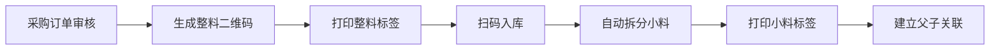

**详细流程：**

1. **采购订单审核通过后**，系统自动为每个物料批次生成唯一的整料二维码（拆分标识为 0）
2. **仓库人员打印整料二维码标签**并粘贴到整料包装上
3. **扫码整料二维码入库**，系统记录入库信息
4. **系统自动拆分小料**：根据 `material_split_configs` 预设的标准拆分单位，生成对应数量的小料二维码（拆分标识为 1）
5. **仓库人员打印小料二维码标签**并粘贴到每个小料单元上
6. **系统建立整料二维码与小料二维码的父子关联关系**（`qr_codes.parent_id`）

**打印集成点**：
- 采购入库单审核后 → 自动生成二维码 → 弹出"打印标签"提示
- 支持批量打印（一次入库多个物料）
- 支持标签重打（标签损坏或丢失）

### 4.2 生产领料环节

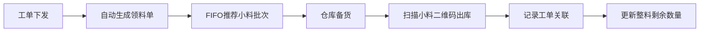

**详细流程：**

1. **工单审核通过并下发后**，系统根据 BOM 自动生成领料单
2. **系统自动计算所需小料数量**，并根据先进先出原则推荐小料批次
3. **仓库人员根据推荐批次准备小料**
4. **扫描小料二维码进行出库**，系统校验：
   - 二维码是否有效
   - 是否已出库
   - 是否为推荐的先进先出批次
5. **系统自动记录**：工单编号、小料二维码、领用数量、领用时间、操作人员
6. **建立工单与小料二维码的关联关系**
7. **小料领用后，系统自动更新整料的剩余数量**

**扫码界面设计**：
```tsx
// app/production/material-requisition/scan/page.tsx
export default function MaterialScanPage() {
  return (
    <ScanLayout title="领料扫码">
      <div className="space-y-6">
        <WorkOrderInfoCard workOrderNo="WO202605100001" />
        <ScanInput
          placeholder="扫描小料二维码..."
          onScan={handleMaterialScan}
          validate={validateQrCode}
        />
        <ScannedList
          items={scannedMaterials}
          onRemove={handleRemove}
        />
        <Button onClick={handleConfirmIssue}>确认出库</Button>
      </div>
    </ScanLayout>
  );
}
```

### 4.3 生产报工环节

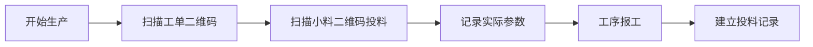

**详细流程：**

1. **生产人员扫描工单二维码**，系统显示该工单关联的标准卡
2. **扫描小料二维码进行投料**，系统记录：
   - 工单编号
   - 工序编号
   - 小料二维码
   - 投料数量
   - 投料时间
3. **生产人员按照标准卡参数进行生产**，记录实际工艺参数
4. **工序报工时**，系统自动关联投料的小料二维码

### 4.4 成品入库环节

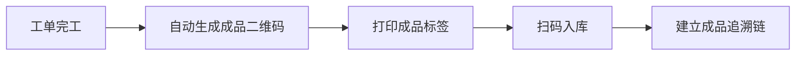

**详细流程：**

1. **工单完工后**，系统自动生成成品二维码（类型 F，拆分标识 0）
2. **打印成品二维码标签**并粘贴到成品包装上
3. **扫码成品二维码入库**，系统记录入库信息
4. **系统自动建立成品追溯链**：
   - 成品二维码 → 工单编号
   - 工单编号 → 投料小料二维码列表
   - 小料二维码 → 整料批次
   - 整料批次 → 采购订单/供应商

**打印集成点**：
- 报工完成 → "打印成品标签" 按钮
- 支持批量打印（同一工单多个成品包装）
- 标签内容包含质检结果（合格/不合格）

### 4.5 销售发货环节

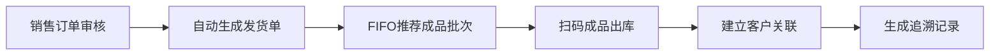

**详细流程：**

1. **销售订单审核通过后**，系统自动生成发货单
2. **系统根据成品先进先出原则推荐发货批次**
3. **仓库人员扫描成品二维码进行出库**，系统校验：
   - 二维码是否有效
   - 是否已发货
   - 是否为推荐的先进先出批次
4. **系统自动建立成品与销售订单、客户的关联关系**
5. **生成完整的追溯记录**，实现从客户到原材料的反向追溯

**发货标签打印**：
- 扫描完所有成品后 → 打印发货清单和发货标签
- 发货标签粘贴到外包装，便于客户收货确认

### 4.6 追溯查询环节

#### 4.6.1 小料追溯（正向追溯）

```
输入小料二维码 → 查询对应的整料批次 → 查询供应商信息 → 查询使用该小料的工单 → 查询成品
```

**API 端点：** `POST /api/qrcode/trace`

**请求参数：**
```json
{
  "qr_code": "VNR2026051000000011"
}
```

**响应示例：**
```json
{
  "code": 200,
  "message": "success",
  "data": {
    "qr_code": "VNR2026051000000011",
    "type": "原材料",
    "split_flag": "小料",
    "parent": {
      "qr_code": "VNR2026051000000010",
      "type": "原材料",
      "split_flag": "整料",
      "batch_no": "RM20260510001",
      "supplier": "XX供应商",
      "inbound_date": "2026-05-10"
    },
    "work_orders": [
      {
        "work_order_no": "WO202605100001",
        "product_name": "丝网印刷产品A",
        "quantity": 5,
        "issue_date": "2026-05-11"
      }
    ],
    "finished_products": [
      {
        "qr_code": "VNF2026051000000010",
        "product_name": "丝网印刷产品A",
        "quantity": 100,
        "receipt_date": "2026-05-12"
      }
    ]
  }
}
```

#### 4.6.2 整料追溯（批次追溯）

```
输入整料二维码 → 查询所有拆分的小料二维码 → 查询每个小料的领用情况 → 查询对应的工单和成品
```

#### 4.6.3 成品追溯（反向追溯）

```
输入成品二维码 → 查询生产工单 → 查询投料小料列表 → 查询整料批次 → 查询供应商
```

#### 4.6.4 客户追溯（质量追溯）

```
输入客户名称/销售订单 → 查询所有发货成品 → 查询生产工单 → 查询投料小料 → 查询整料批次
```

---

## 5. 数据结构设计

### 5.1 二维码主表（qr_codes）

| 字段名 | 类型 | 说明 |
|--------|------|------|
| id | bigint | 主键 |
| qr_code | varchar(20) | 二维码编码，唯一 |
| type | varchar(1) | 类型：R=原材料，F=成品，W=工单，S=销售订单 |
| split_flag | smallint | 拆分标识：0=整料，1=小料，2=余料 |
| parent_id | bigint | 父二维码 ID（小料和余料关联整料） |
| material_id | bigint | 关联物料 ID |
| batch_no | varchar(50) | 批次号 |
| quantity | decimal(10,2) | 数量 |
| unit | varchar(10) | 单位 |
| warehouse_id | bigint | 仓库 ID |
| warehouse_location | varchar(50) | 库位 |
| status | smallint | 状态：0=未使用，1=已使用，2=已冻结 |
| inbound_date | datetime | 入库时间 |
| expiry_date | date | 效期 |
| create_time | datetime | 创建时间 |
| update_time | datetime | 更新时间 |

### 5.2 二维码追溯记录表（qrcode_record）

| 字段名 | 类型 | 说明 |
|--------|------|------|
| id | bigint | 主键 |
| qr_code | varchar(20) | 二维码编码 |
| type | varchar(20) | 记录类型：入库/出库/投料/报工/发货 |
| ref_type | varchar(50) | 关联单据类型 |
| ref_id | bigint | 关联单据 ID |
| ref_no | varchar(50) | 关联单据编号 |
| quantity | decimal(10,2) | 数量 |
| operator_id | bigint | 操作人员 ID |
| operator_name | varchar(50) | 操作人员姓名 |
| create_time | datetime | 记录时间 |
| remark | text | 备注 |

### 5.3 整料小料关联表（material_splits）

| 字段名 | 类型 | 说明 |
|--------|------|------|
| id | bigint | 主键 |
| parent_qr_code | varchar(20) | 整料二维码 |
| child_qr_code | varchar(20) | 小料/余料二维码 |
| split_type | smallint | 拆分类型：1=小料，2=余料 |
| split_quantity | decimal(10,2) | 拆分数量 |
| split_unit | varchar(10) | 拆分单位 |
| create_time | datetime | 拆分时间 |
| operator_id | bigint | 操作人员 ID |

### 5.4 标签打印记录表（label_print_records）

| 字段名 | 类型 | 说明 |
|--------|------|------|
| id | bigint | 主键 |
| qr_code | varchar(20) | 二维码编码 |
| label_type | varchar(20) | 标签类型 |
| label_spec | varchar(20) | 标签规格 |
| printer_name | varchar(50) | 打印机名称 |
| print_command | text | 打印指令内容 |
| status | smallint | 状态：0=待打印，1=打印中，2=打印成功，3=打印失败 |
| error_msg | text | 错误信息 |
| operator_id | bigint | 操作员 ID |
| operator_name | varchar(50) | 操作员姓名 |
| print_time | datetime | 打印时间 |
| create_time | datetime | 创建时间 |

### 5.5 打印机配置表（printer_configs）

| 字段名 | 类型 | 说明 |
|--------|------|------|
| id | bigint | 主键 |
| printer_name | varchar(50) | 打印机名称 |
| printer_type | varchar(20) | 类型：zebra/tsc/godex/laser |
| connection_type | varchar(20) | 连接方式：usb/serial/network/bluetooth |
| connection_config | json | 连接配置（端口/IP等） |
| label_width | decimal(5,2) | 标签宽度(mm) |
| label_height | decimal(5,2) | 标签高度(mm) |
| dpi | int | 分辨率 |
| is_default | tinyint | 是否默认打印机 |
| status | tinyint | 状态：0=禁用，1=启用 |
| create_time | datetime | 创建时间 |
| update_time | datetime | 更新时间 |

---

## 6. 核心接口设计

### 6.1 生成二维码

```http
POST /api/qrcode/generate
Content-Type: application/json
Authorization: Bearer {token}

{
  "type": "R",
  "material_id": 1,
  "quantity": 100,
  "unit": "米",
  "warehouse_id": 1
}
```

### 6.2 批量生成小料二维码

```http
POST /api/qrcode/split
Content-Type: application/json
Authorization: Bearer {token}

{
  "parent_qr_code": "VNR2026051000000010",
  "split_qty": 10,
  "split_unit": "米"
}
```

### 6.3 追溯查询

```http
POST /api/qrcode/trace
Content-Type: application/json
Authorization: Bearer {token}

{
  "qr_code": "VNR2026051000000011"
}
```

### 6.4 扫码验证

```http
POST /api/qrcode/verify
Content-Type: application/json
Authorization: Bearer {token}

{
  "qr_code": "VNR2026051000000011",
  "action": "出库"
}
```

### 6.5 打印标签

```http
POST /api/qrcode/print
Content-Type: application/json
Authorization: Bearer {token}

{
  "qr_code": "VNR2026051000000010",
  "label_type": "material",
  "label_spec": "L-60x40",
  "printer_id": 1,
  "copies": 1,
  "data": {
    "materialName": "黄色丝印油墨",
    "batchNo": "RM20260510001",
    "quantity": 100,
    "unit": "KG",
    "supplier": "XX化工有限公司",
    "date": "2026-05-10"
  }
}
```

### 6.6 获取打印机列表

```http
GET /api/printers
Authorization: Bearer {token}
```

**响应示例：**
```json
{
  "code": 200,
  "message": "success",
  "data": [
    {
      "id": 1,
      "printer_name": "仓库标签打印机-01",
      "printer_type": "zebra",
      "connection_type": "usb",
      "label_width": 60,
      "label_height": 40,
      "is_default": true,
      "status": 1
    }
  ]
}
```

### 6.7 补打标签

```http
POST /api/qrcode/reprint
Content-Type: application/json
Authorization: Bearer {token}

{
  "qr_code": "VNR2026051000000010",
  "reason": "标签损坏",
  "printer_id": 1
}
```

---

## 7. 与其他模块的集成

| 模块 | 集成点 | 标签打印 |
|------|--------|----------|
| 采购管理 | 采购入库时自动生成整料二维码 | 入库时打印整料标签 |
| 仓库管理 | 出入库时扫码验证和记录 | 小料拆分打印、余料打印 |
| 生产管理 | 工单关联二维码，投料记录 | 工单流转卡打印 |
| 品质管理 | 检验记录关联二维码 | 质检合格标签打印 |
| 销售管理 | 发货时扫码出库，建立客户关联 | 发货标签打印 |
| 财务管理 | 成本核算时获取二维码关联的批次成本 | - |

### 7.1 采购管理集成

```typescript
// 采购入库时自动生成二维码并打印
async function handlePurchaseInbound(inboundOrder: InboundOrder) {
  for (const item of inboundOrder.items) {
    // 1. 生成整料二维码
    const qrCode = await qrCodeService.generate({
      type: 'R',
      material_id: item.material_id,
      quantity: item.quantity,
      unit: item.unit,
    });

    // 2. 自动打印整料标签
    await printService.printLabel({
      qrCode: qrCode.code,
      labelType: 'material',
      data: {
        materialName: item.material_name,
        batchNo: item.batch_no,
        quantity: item.quantity,
        unit: item.unit,
        supplier: inboundOrder.supplier_name,
        date: new Date().toISOString(),
      },
    });
  }
}
```

### 7.2 仓库管理集成

```typescript
// 小料拆分时批量打印
async function handleMaterialSplit(parentQrCode: string, splitConfig: SplitConfig) {
  // 1. 生成小料二维码
  const childQrCodes = await qrCodeService.split({
    parent_qr_code: parentQrCode,
    split_qty: splitConfig.quantity,
    split_unit: splitConfig.unit,
  });

  // 2. 批量打印小料标签
  for (const childQr of childQrCodes) {
    await printService.printLabel({
      qrCode: childQr.code,
      labelType: 'small',
      data: {
        materialName: childQr.material_name,
        quantity: childQr.quantity,
        unit: childQr.unit,
        parentBatch: parentQrCode,
      },
    });
  }
}
```

### 7.3 生产管理集成

```typescript
// 工单下发时打印流转卡
async function handleWorkOrderRelease(workOrder: WorkOrder) {
  // 1. 生成工单二维码
  const qrCode = await qrCodeService.generate({
    type: 'W',
    work_order_id: workOrder.id,
  });

  // 2. 打印工单流转卡
  await printService.printLabel({
    qrCode: qrCode.code,
    labelType: 'workorder',
    data: {
      title: '生产流转卡',
      workOrderNo: workOrder.order_no,
      productName: workOrder.product_name,
      quantity: workOrder.plan_qty,
      processFlow: workOrder.processes.map(p => p.name).join('→'),
      planDate: `${workOrder.start_date} ~ ${workOrder.end_date}`,
    },
  });
}
```

### 7.4 成品入库集成

```typescript
// 报工完成时打印成品标签
async function handleWorkReportComplete(workReport: WorkReport) {
  // 1. 生成成品二维码
  const qrCode = await qrCodeService.generate({
    type: 'F',
    work_order_id: workReport.work_order_id,
    quantity: workReport.completed_qty,
  });

  // 2. 打印成品标签
  await printService.printLabel({
    qrCode: qrCode.code,
    labelType: 'finished',
    data: {
      title: '成品标签',
      productName: workReport.product_name,
      workOrderNo: workReport.work_order_no,
      quantity: workReport.completed_qty,
      unit: 'PCS',
      date: new Date().toISOString(),
      quality: workReport.quality_status === 'pass' ? '合格' : '不合格',
    },
  });
}
```

---

## 8. 二维码控件设计

### 8.1 核心二维码控件列表

| 控件名称 | 功能描述 | 适用模块 | 组件路径 |
|----------|----------|----------|----------|
| QRCodeGenerator | 生成二维码 | 全局 | components/qr-code/QRCodeGenerator |
| QRCodePrinter | 打印二维码 | 全局 | components/qr-code/QRCodePrinter |
| QRCodeScanner | 扫描二维码 | 全局 | components/qr-code/QRCodeScanner |
| QRCodeViewer | 查看二维码 | 全局 | components/qr-code/QRCodeViewer |
| QRCodeSearch | 二维码查询 | 全局 | components/qr-code/QRCodeSearch |
| QRCodeTrace | 追溯查询 | 全局 | components/qr-code/QRCodeTrace |

### 8.2 各模块二维码控件集成

#### 8.2.1 采购管理模块

```
┌─────────────────────────────────────────────────────────┐
│  采购入库单详情页                                        │
│  ┌─────────────────────────────────────────────────────┐│
│  │  [二维码控件区域]                                    ││
│  │  ┌─────────────┐  ┌─────────────┐  ┌─────────────┐  ││
│  │  │ 生成二维码   │  │ 打印标签    │  │ 批量打印    │  ││
│  │  └─────────────┘  └─────────────┘  └─────────────┘  ││
│  │                                                      ││
│  │  物料列表:                                          ││
│  │  [QR] 物料A - 批次: XXX - [打印] [查看] [追溯]      ││
│  │  [QR] 物料B - 批次: XXX - [打印] [查看] [追溯]      ││
│  └─────────────────────────────────────────────────────┘│
└─────────────────────────────────────────────────────────┘
```

**控件配置：**
- 自动生成：采购入库审核通过后自动生成整料二维码
- 打印控件：支持批量打印和单个打印
- 查询控件：显示二维码基本信息及追溯链接

**API集成：**
- POST /api/qrcode/generate - 生成二维码
- POST /api/qrcode/print - 打印标签
- POST /api/qrcode/trace - 追溯查询

```tsx
// 采购入库页面二维码控件集成示例
import { QRCodeGenerator } from '@/components/qr-code/QRCodeGenerator';
import { QRCodePrinter } from '@/components/qr-code/QRCodePrinter';
import { QRCodeTrace } from '@/components/qr-code/QRCodeTrace';

export function PurchaseInboundDetail({ purchaseOrder }) {
  const handleGenerateQRCode = async (materialId) => {
    const result = await generateQRCode({
      type: 'R',
      material_id: materialId,
      quantity: purchaseOrder.items.find(i => i.material_id === materialId).quantity,
      unit: purchaseOrder.items.find(i => i.material_id === materialId).unit,
    });
    return result.qr_code;
  };

  const handlePrintLabel = (qrCode, materialName) => {
    return printLabel({
      qr_code: qrCode,
      label_type: 'material',
      data: {
        materialName,
        batchNo: purchaseOrder.batch_no,
        quantity: purchaseOrder.items.find(i => i.material_id === materialId)?.quantity,
      }
    });
  };

  return (
    <div className="qr-code-controls">
      <QRCodeGenerator onGenerate={handleGenerateQRCode} />
      <QRCodePrinter onPrint={handlePrintLabel} />
      <QRCodeTrace />
    </div>
  );
}
```

#### 8.2.2 仓库管理模块

```
┌─────────────────────────────────────────────────────────┐
│  仓库库存页面                                           │
│  ┌─────────────────────────────────────────────────────┐│
│  │  [扫描入库] [扫描出库] [拆分小料] [补打标签]        ││
│  └─────────────────────────────────────────────────────┘│
│  ┌─────────────────────────────────────────────────────┐│
│  │  库存列表:                                          ││
│  │  [QR] 整料A - 库存: 100 - [领用] [拆分] [打印]     ││
│  │  [QR] 小料B - 库存: 50  - [补打] [追溯]            ││
│  │  [QR] 余料C - 库存: 20  - [打印]                   ││
│  └─────────────────────────────────────────────────────┘│
└─────────────────────────────────────────────────────────┘
```

**控件功能：**
- 扫描入库控件：支持摄像头扫码和PDA扫码
- 扫描出库控件：验证二维码有效性，支持FIFO自动推荐
- 拆分小料控件：选择整料，输入拆分数量，批量生成小料二维码
- 补打标签控件：选择二维码，重新打印标签

```tsx
// 仓库库存页面二维码控件
import { QRCodeScanner } from '@/components/qr-code/QRCodeScanner';
import { QRCodePrinter } from '@/components/qr-code/QRCodePrinter';

export function WarehouseInventoryPage() {
  const [scanMode, setScanMode] = useState<'inbound' | 'outbound'>('inbound');

  const handleScan = async (qrCode) => {
    if (scanMode === 'inbound') {
      // 扫码入库逻辑
      const result = await verifyQRCode(qrCode, 'inbound');
      if (result.valid) {
        await recordInbound(qrCode);
        toast.success('入库成功');
      }
    } else {
      // 扫码出库逻辑
      const result = await verifyQRCode(qrCode, 'outbound');
      if (result.valid) {
        await recordOutbound(qrCode);
        toast.success('出库成功');
      }
    }
  };

  return (
    <div>
      <div className="flex gap-2 mb-4">
        <Button onClick={() => setScanMode('inbound')}>扫码入库</Button>
        <Button onClick={() => setScanMode('outbound')}>扫码出库</Button>
      </div>
      <QRCodeScanner
        mode={scanMode}
        onScan={handleScan}
        validate={(qr) => validateQRCode(qr, scanMode)}
      />
    </div>
  );
}
```

#### 8.2.3 生产管理模块

```
┌─────────────────────────────────────────────────────────┐
│  生产工单详情页                                         │
│  ┌─────────────────────────────────────────────────────┐│
│  │  工单信息: WO202605100001                           ││
│  │  [QR] 工单二维码 - [打印流转卡] [查看]             ││
│  └─────────────────────────────────────────────────────┘│
│  ┌─────────────────────────────────────────────────────┐│
│  │  投料记录:                                          ││
│  │  [QR] 小料A - 投料数量: 10 - [扫码投料]            ││
│  │  [QR] 小料B - 投料数量: 20 - [扫码投料]            ││
│  └─────────────────────────────────────────────────────┘│
└─────────────────────────────────────────────────────────┘
```

**控件功能：**
- 工单二维码控件：生成工单二维码，打印流转卡
- 投料扫描控件：扫描小料二维码，记录投料信息
- 报工二维码控件：生成成品二维码，打印成品标签

```tsx
// 生产工单页面二维码控件
import { QRCodeGenerator } from '@/components/qr-code/QRCodeGenerator';
import { QRCodeScanner } from '@/components/qr-code/QRCodeScanner';

export function ProductionWorkOrderPage({ workOrder }) {
  const handleMaterialFeed = async (qrCode, quantity) => {
    // 验证小料二维码
    const valid = await validateMaterialQRCode(qrCode);
    if (!valid) {
      toast.error('无效的小料二维码');
      return;
    }
    // 记录投料
    await recordMaterialFeed({
      work_order_no: workOrder.order_no,
      qr_code: qrCode,
      quantity,
      operator: currentUser.id,
    });
    toast.success('投料成功');
  };

  return (
    <div>
      <Card>
        <CardHeader>
          <div className="flex justify-between items-center">
            <span>工单: {workOrder.order_no}</span>
            <div className="flex gap-2">
              <QRCodeGenerator
                type="W"
                refId={workOrder.id}
                onGenerate={(qr) => printWorkOrderCard(qr)}
              />
            </div>
          </div>
        </CardHeader>
        <CardContent>
          <QRCodeScanner
            placeholder="扫描小料二维码投料"
            onScan={handleMaterialFeed}
          />
        </CardContent>
      </Card>
    </div>
  );
}
```

#### 8.2.4 销售发货模块

```
┌─────────────────────────────────────────────────────────┐
│  销售发货页面                                           │
│  ┌─────────────────────────────────────────────────────┐│
│  │  [扫码出库] [生成发货单] [打印发货标签]            ││
│  └─────────────────────────────────────────────────────┘│
│  ┌─────────────────────────────────────────────────────┐│
│  │  发货列表:                                          ││
│  │  [QR] 成品A - 客户: XXX - [扫码] [打印标签]        ││
│  │  [QR] 成品B - 客户: XXX - [扫码] [打印标签]        ││
│  └─────────────────────────────────────────────────────┘│
└─────────────────────────────────────────────────────────┘
```

**控件功能：**
- 扫码出库控件：扫描成品二维码，验证并发货
- 发货标签控件：打印发货标签，包含客户信息

```tsx
// 销售发货页面二维码控件
export function SalesDeliveryPage({ deliveryOrder }) {
  const handleScanOutbound = async (qrCode) => {
    // 验证成品二维码
    const valid = await validateFinishedProductQRCode(qrCode);
    if (!valid) {
      toast.error('无效的成品二维码或已发货');
      return;
    }
    // 记录出库
    await recordDelivery({
      delivery_no: deliveryOrder.delivery_no,
      qr_code: qrCode,
      operator: currentUser.id,
    });
    toast.success('出库成功');
  };

  return (
    <div>
      <QRCodeScanner
        placeholder="扫描成品二维码出库"
        onScan={handleScanOutbound}
        validate={(qr) => validateFinishedProductQRCode(qr)}
      />
    </div>
  );
}
```

#### 8.2.5 品质管理模块

```
┌─────────────────────────────────────────────────────────┐
│  质检详情页                                            │
│  ┌─────────────────────────────────────────────────────┐│
│  │  [QR] 成品二维码                                    ││
│  │  质检结果: 合格/不合格                              ││
│  │  [打印质检标签]                                     ││
│  └─────────────────────────────────────────────────────┘│
└─────────────────────────────────────────────────────────┘
```

**控件功能：**
- 质检二维码控件：关联质检结果，打印质检标签

#### 8.2.6 二维码查询控件

```
┌─────────────────────────────────────────────────────────┐
│  二维码查询页面                                         │
│  ┌─────────────────────────────────────────────────────┐│
│  │  [扫码查询] [输入查询] [批量查询]                  ││
│  │                                                      ││
│  │  输入二维码: [________________] [查询]             ││
│  │                                                      ││
│  └─────────────────────────────────────────────────────┘│
│  ┌─────────────────────────────────────────────────────┐│
│  │  查询结果:                                          ││
│  │  二维码: VNR2026051000000010                        ││
│  │  类型: 原材料-整料                                  ││
│  │  批次: RM20260510001                                ││
│  │  供应商: XXX                                        ││
│  │  状态: 已使用                                       ││
│  │                                                      ││
│  │  追溯链路:                                          ││
│  │  原材料 → 工单 → 成品 → 客户                        ││
│  │  [查看详情] [导出PDF]                              ││
│  └─────────────────────────────────────────────────────┘│
└─────────────────────────────────────────────────────────┘
```

```tsx
// 二维码查询控件
import { QRCodeScanner } from '@/components/qr-code/QRCodeScanner';
import { QRCodeTrace } from '@/components/qr-code/QRCodeTrace';

export function QRCodeQueryPage() {
  const [queryResult, setQueryResult] = useState(null);

  const handleQuery = async (qrCode) => {
    const result = await queryQRCode(qrCode);
    setQueryResult(result);
  };

  const handleTrace = async (qrCode) => {
    const traceResult = await traceQRCode(qrCode);
    setTraceResult(traceResult);
  };

  return (
    <div className="grid grid-cols-2 gap-4">
      <div>
        <QRCodeScanner
          placeholder="扫描二维码查询"
          onScan={handleQuery}
        />
        <Input
          placeholder="输入二维码查询"
          onChange={(e) => handleQuery(e.target.value)}
        />
      </div>
      {queryResult && (
        <div>
          <QRCodeTrace
            qrCode={queryResult.qr_code}
            traceData={queryResult.trace}
          />
        </div>
      )}
    </div>
  );
}
```

### 8.3 二维码扫描控件详细设计

#### 8.3.1 扫描控件属性

```tsx
interface QRCodeScannerProps {
  placeholder?: string;           // 输入框占位符
  onScan: (qrCode: string) => Promise<void>;  // 扫描回调
  validate?: (qrCode: string) => Promise<boolean>;  // 验证函数
  autoFocus?: boolean;             // 自动聚焦
  showHistory?: boolean;           // 显示历史记录
  scanMode?: 'single' | 'continuous';  // 扫描模式
}
```

#### 8.3.2 扫描流程

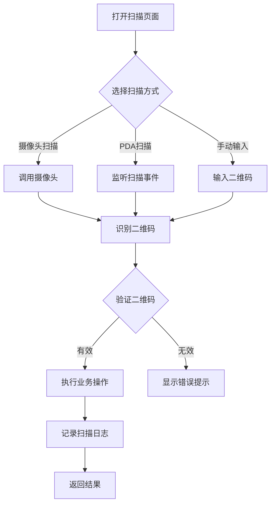

### 8.4 二维码追溯控件详细设计

#### 8.4.1 追溯控件功能

```tsx
interface QRCodeTraceProps {
  qrCode: string;                  // 二维码
  traceData?: TraceData;           // 追溯数据
  direction?: 'forward' | 'backward';  // 追溯方向
  showTimeline?: boolean;          // 显示时间线
  onExport?: () => void;           // 导出回调
}
```

#### 8.4.2 追溯展示效果

```
┌─────────────────────────────────────────────────────────┐
│  追溯时间线                                             │
│  ┌─────────────────────────────────────────────────────┐│
│  │  📦 原材料入库                                      ││
│  │     2026-05-10 10:00                                ││
│  │     供应商: XXX化工                                 ││
│  │     批次: RM20260510001                             ││
│  │     ─────────────────────────────────────────       ││
│  │  🔀 小料拆分                                        ││
│  │     2026-05-11 14:00                                ││
│  │     拆分数量: 10个                                  ││
│  │     ─────────────────────────────────────────       ││
│  │  📥 生产领料                                        ││
│  │     2026-05-11 16:00                                ││
│  │     工单: WO202605100001                            ││
│  │     ─────────────────────────────────────────       ││
│  │  ⚙️ 生产报工                                        ││
│  │     2026-05-12 10:00                                ││
│  │     成品数量: 100 PCS                               ││
│  │     ─────────────────────────────────────────       ││
│  │  📤 成品出库                                        ││
│  │     2026-05-13 09:00                                ││
│  │     客户: ABC公司                                   ││
│  └─────────────────────────────────────────────────────┘│
└─────────────────────────────────────────────────────────┘
```

---

## 9. 异常处理

| 异常场景 | 处理方式 |
|----------|----------|
| 二维码重复 | 系统提示"该二维码已存在"，禁止重复生成 |
| 二维码无效 | 系统提示"无效的二维码"，禁止操作 |
| 二维码已使用 | 系统提示"该物料已出库/已发货"，禁止重复操作 |
| 整料未拆分 | 系统提示"整料未拆分，请先拆分小料"，禁止直接领用 |
| 小料不足 | 系统提示"小料库存不足"，建议拆分新的整料 |
| 追溯链断裂 | 系统标记异常，通知管理员核查 |
| 打印失败 | 记录失败原因，支持重试和手动补打 |
| 打印机离线 | 提示检查打印机连接，保存打印任务到队列 |
| 标签纸用尽 | 检测打印状态，提示更换标签纸 |

---

## 10. 报表统计

- **二维码使用情况报表**：统计各类二维码的生成和使用情况
- **追溯查询统计报表**：统计追溯查询的次数和类型
- **物料流向分析报表**：分析物料从入库到出库的流向
- **批次追溯效率报表**：统计批次追溯的平均时间和成功率
- **标签打印统计报表**：统计各打印机的使用情况和耗材消耗

---

## 11. 实施建议

### 11.1 硬件推荐

| 设备类型 | 推荐型号 | 适用场景 |
|----------|----------|----------|
| 条码打印机 | Zebra ZT230 / TSC TTP-244 Pro | 仓库标签打印 |
| 工业打印机 | Zebra ZT410 / Godex EZ2350i | 产线高速打印 |
| PDA 扫码枪 | Honeywell EDA52 / Urovo DT50 | 仓库/产线移动扫码 |
| 固定扫码器 | Datalogic GD4500 | 产线固定工位 |
| 标签纸 | 铜版纸/合成纸/PET | 根据环境选择 |

### 11.2 实施阶段

**Phase 1：基础功能**
- 二维码生成规则实现
- 基础标签模板设计
- 浏览器打印支持

**Phase 2：模块集成**
- 采购入库标签打印
- 仓库小料拆分打印
- 生产流转卡打印

**Phase 3：完善功能**
- 打印服务中间件部署
- 多打印机管理
- 打印任务队列

**Phase 4：高级功能**
- PDA 蓝牙打印
- 云打印管理
- 打印数据分析

---

## 12. 附录

### 12.1 二维码类型对照表

| 类型代码 | 类型名称 | 适用场景 | 示例 |
|----------|----------|----------|------|
| R-0 | 原材料-整料 | 采购入库 | VNR2026051000000010 |
| R-1 | 原材料-小料 | 仓库拆分 | VNR2026051000000011 |
| R-2 | 原材料-余料 | 领料剩余 | VNR2026051000000012 |
| F-0 | 成品 | 生产完工 | VNF2026051000000010 |
| W | 工单 | 生产流转 | VNW2026051000000010 |
| S | 销售订单 | 销售发货 | VNS2026051000000010 |

### 12.2 打印机指令对照表

| 打印机品牌 | 指令语言 | 二维码命令 | 示例 |
|------------|----------|------------|------|
| Zebra | ZPL | ^BQ | ^BQN,2,5 |
| TSC | TSPL | QRCODE | QRCODE x,y,L,5,A,0,"data" |
| Godex | EZPL | QRCODE | QRCODE 50,50,H,0,A,0,M2,DATA |
| Postek | PL/II | QRCode | QRCode x,y,size,rotation,model,content |

### 12.3 常用二维码扫描设备

| 设备类型 | 推荐型号 | 接口方式 | 适用场景 |
|----------|----------|----------|----------|
| 手持扫描枪 | Honeywell HH660 | USB/蓝牙 | 仓库固定工位 |
| 工业扫描枪 | Zebra DS9908 | USB/RS232 | 产线高速扫描 |
| PDA手持终端 | Urovo DT50 | WiFi/4G | 移动作业 |
| 固定式扫描器 | Datalogic GD4500 | USB/以太网 | 自动化产线 |

### 12.4 标签纸规格选择指南

| 应用场景 | 推荐规格 | 材质 | 耐温范围 |
|----------|----------|------|----------|
| 室内普通标签 | L-60x40 | 铜版纸 | 0-60℃ |
| 户外/耐候标签 | L-80x60 | PET合成纸 | -20-80℃ |
| 低温冷库标签 | L-50x30 | 合成纸+胶 | -40-60℃ |
| 高温烘烤标签 | L-40x20 | PET | -40-150℃ |

### 12.5 常见问题排查

| 问题现象 | 可能原因 | 解决方案 |
|----------|----------|----------|
| 二维码扫描失败 | 摄像头权限未开启 | 检查浏览器权限设置 |
| 打印位置偏移 | 打印机校准未完成 | 执行打印机自校准 |
| 打印内容模糊 | 打印头脏污或耗材问题 | 清洁打印头或更换耗材 |
| 二维码无法识别 | 二维码尺寸过小 | 调整标签规格或打印密度 |
| 追溯数据不完整 | 业务环节数据未同步 | 检查各模块数据对接状态 |
