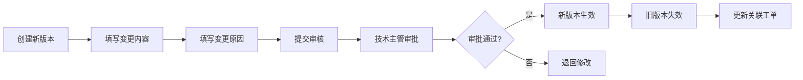

# 标准卡管理模块 详细设计

> 文档编号：VNERP-DESIGN-006  
> 版本：V1.0  
> 更新日期：2026-05-10

---

## 1. 模块概述

### 1.1 设计目标

本模块是丝网印刷 ERP 系统的核心基础数据模块，专门针对丝网印刷行业特点设计，统一管理生产过程中所有标准化的工艺参数、质量标准和颜色标准。解决行业普遍存在的工艺参数不统一、颜色偏差大、质量标准不一致、新员工培训困难等痛点。标准卡是生产和品质检验的唯一依据，所有生产工单和检验任务都必须关联对应的标准卡。

### 1.2 核心能力

- **标准化**：所有工艺参数、质量标准、颜色标准必须数字化、标准化
- **版本控制**：支持标准卡的版本管理，保留历史版本记录
- **关联驱动**：生产工单和检验任务自动关联对应标准卡
- **一键调用**：生产人员扫码即可查看标准卡内容
- **持续优化**：支持标准卡的迭代优化，记录优化历史

---

## 2. 核心设计原则

| 原则 | 说明 | 系统保障 |
|------|------|----------|
| 标准化 | 所有参数数字化、标准化 | 必填校验 |
| 版本控制 | 支持版本管理，保留历史 | 版本号递增 |
| 关联驱动 | 工单自动关联标准卡 | 创建工单时自动匹配 |
| 一键调用 | 扫码查看标准卡 | 扫码API |
| 持续优化 | 支持迭代优化 | 版本对比功能 |

---

## 3. 标准卡类型

| 类型 | 说明 | 用途 |
|------|------|------|
| 颜色标准卡 | 定义产品的颜色标准，包含 CMYK 值、潘通色号、色样图片 | 印刷颜色校准、颜色检验 |
| 工艺标准卡 | 定义产品的生产工艺参数，包含制版、印刷、烘干、后加工等工序参数 | 生产过程指导、工艺参数控制 |
| 质量标准卡 | 定义产品的质量检验标准，包含检验项目、标准值、公差范围、检验方法 | 品质检验依据、不合格判定 |
| 综合标准卡 | 整合颜色、工艺、质量标准于一体的完整产品标准 | 复杂产品的全流程生产指导 |

---

## 4. 核心流程设计

### 4.1 标准卡创建流程


**详细流程：**

1. **工艺工程师在系统中创建标准卡**
2. **填写标准卡基本信息**：名称、编号、版本、适用产品、生效日期
3. **上传标准卡内容**：参数、图片、视频、文档
4. **提交技术主管审核**
5. **审核通过后，标准卡生效**
6. **系统自动通知相关生产和品质人员**

### 4.2 标准卡版本更新流程



**详细流程：**

1. **工艺工程师创建新版本标准卡**
2. **填写变更内容和变更原因**
3. **提交技术主管审核**
4. **审核通过后，新版本生效，旧版本自动失效**
5. **系统自动更新所有关联的生产工单和检验任务**
6. **保留旧版本记录，便于追溯**

### 4.3 标准卡使用流程


**详细流程：**

1. **生产工单创建时，系统自动关联对应产品的最新版本标准卡**
2. **生产人员扫描工单二维码，即可查看该工单的标准卡内容**
3. **生产人员按照标准卡参数进行生产**
4. **品质人员按照标准卡进行检验**
5. **生产和检验记录自动关联标准卡版本**

---

## 5. 数据结构设计

### 5.1 标准卡主表（standard_cards）

| 字段名 | 类型 | 说明 |
|--------|------|------|
| id | bigint | 主键 |
| card_no | varchar(20) | 标准卡编号，格式：SC+类型代码+YYYYMMDD+3位序号 |
| name | varchar(100) | 标准卡名称 |
| type | varchar(10) | 类型：颜色标准卡、工艺标准卡、质量标准卡、综合标准卡 |
| version | varchar(20) | 版本号，格式：V1.0 |
| material_id | bigint | 适用产品 ID |
| status | varchar(20) | 状态：草稿、待审核、已生效、已失效 |
| effective_date | date | 生效日期 |
| expiry_date | date | 失效日期 |
| create_user | bigint | 创建人 |
| audit_user | bigint | 审核人 |
| create_time | datetime | 创建时间 |
| update_time | datetime | 更新时间 |
| remark | text | 备注 |

### 5.2 颜色标准卡明细表（color_standard_items）

| 字段名 | 类型 | 说明 |
|--------|------|------|
| id | bigint | 主键 |
| standard_card_id | bigint | 关联标准卡 ID |
| color_name | varchar(50) | 颜色名称 |
| pantone_code | varchar(20) | 潘通色号 |
| cmyk_value | varchar(20) | CMYK 值，格式：C,M,Y,K |
| rgb_value | varchar(20) | RGB 值，格式：R,G,B |
| color_sample_image | varchar(200) | 色样图片 URL |
| tolerance | varchar(50) | 颜色公差范围 |

### 5.3 工艺标准卡明细表（process_standard_items）

| 字段名 | 类型 | 说明 |
|--------|------|------|
| id | bigint | 主键 |
| standard_card_id | bigint | 关联标准卡 ID |
| process_id | bigint | 关联工序 ID |
| parameter_name | varchar(50) | 参数名称 |
| standard_value | varchar(100) | 标准值 |
| tolerance | varchar(50) | 公差范围 |
| unit | varchar(10) | 单位 |
| description | text | 参数说明 |

### 5.4 质量标准卡明细表（quality_standard_items）

| 字段名 | 类型 | 说明 |
|--------|------|------|
| id | bigint | 主键 |
| standard_card_id | bigint | 关联标准卡 ID |
| inspection_item | varchar(100) | 检验项目 |
| standard_value | varchar(100) | 标准值 |
| tolerance | varchar(50) | 公差范围 |
| inspection_method | varchar(200) | 检验方法 |
| is_key | boolean | 是否关键项目 |
| defect_level | varchar(10) | 缺陷等级：致命、严重、一般、轻微 |

---

## 6. 核心接口设计

### 6.1 获取产品标准卡

```http
GET /api/standard-cards/by-material/{material_id}
Authorization: Bearer {token}

Response:
{
  "code": 200,
  "message": "success",
  "data": {
    "card_no": "SCC20260510001",
    "name": "产品A颜色标准卡",
    "type": "颜色标准卡",
    "version": "V1.0",
    "effective_date": "2026-05-10",
    "items": [
      {
        "color_name": "红色",
        "pantone_code": "PANTONE 186C",
        "cmyk_value": "0,100,100,0",
        "rgb_value": "255,0,0",
        "color_sample_image": "/media/color/red.png",
        "tolerance": "±5%"
      }
    ]
  }
}
```

### 6.2 获取工单标准卡

```http
GET /api/standard-cards/by-work-order/{work_order_id}
Authorization: Bearer {token}

Response:
{
  "code": 200,
  "message": "success",
  "data": [
    {
      "card_no": "SCP20260510001",
      "name": "产品A工艺标准卡",
      "type": "工艺标准卡",
      "version": "V1.0"
    },
    {
      "card_no": "SCQ20260510001",
      "name": "产品A质量标准卡",
      "type": "质量标准卡",
      "version": "V1.0"
    }
  ]
}
```

### 6.3 扫码查看标准卡

```http
POST /api/standard-cards/scan
Content-Type: application/json
Authorization: Bearer {token}

{
  "qr_code": "VNW202605100001"
}

Response:
{
  "code": 200,
  "message": "success",
  "data": {
    "work_order_no": "WO202605100001",
    "standard_cards": [
      {
        "card_no": "SCP20260510001",
        "name": "产品A工艺标准卡",
        "type": "工艺标准卡",
        "version": "V1.0",
        "items": [
          {
            "process_name": "印刷",
            "parameter_name": "印刷速度",
            "standard_value": "30",
            "tolerance": "±5",
            "unit": "m/min"
          }
        ]
      }
    ]
  }
}
```

### 6.4 创建标准卡

```http
POST /api/standard-cards
Content-Type: application/json
Authorization: Bearer {token}

{
  "name": "产品A工艺标准卡",
  "type": "工艺标准卡",
  "version": "V1.0",
  "material_id": 2,
  "effective_date": "2026-05-10",
  "items": [
    {
      "process_id": 2,
      "parameter_name": "印刷速度",
      "standard_value": "30",
      "tolerance": "±5",
      "unit": "m/min"
    }
  ]
}
```

### 6.5 参数偏差检测

```http
POST /api/standard-cards/check-deviation
Content-Type: application/json
Authorization: Bearer {token}

{
  "standard_card_id": 1,
  "actual_params": [
    {
      "parameter_name": "印刷速度",
      "actual_value": "35"
    }
  ]
}

Response:
{
  "code": 200,
  "message": "success",
  "data": {
    "has_deviation": true,
    "deviations": [
      {
        "parameter_name": "印刷速度",
        "standard_value": "30",
        "actual_value": "35",
        "tolerance": "±5",
        "deviation": "+5",
        "is_within_tolerance": false
      }
    ],
    "warning_level": "error"
  }
}
```

---

## 7. 与其他模块的集成

| 模块 | 集成点 |
|------|--------|
| 基础数据管理 | 标准卡与产品、工序等基础数据关联 |
| 生产管理 | 工单创建时自动关联对应标准卡，生产人员扫码查看 |
| 工序报工 | 报工时可记录实际工艺参数，与标准参数对比 |
| 品质管理 | 检验任务自动关联对应质量标准卡，作为检验依据 |
| 二维码追溯 | 扫码成品二维码可查看该产品使用的标准卡版本 |
| 系统管理 | 只有工艺工程师和技术主管可以创建和修改标准卡 |

---

## 8. 异常处理

| 异常场景 | 处理方式 |
|----------|----------|
| 标准卡未定义 | 系统自动提示并禁止创建生产工单 |
| 标准卡已失效 | 系统自动提示并使用最新版本标准卡 |
| 标准卡版本冲突 | 系统自动使用最新生效版本，并记录版本变更历史 |
| 实际参数与标准参数偏差过大 | 系统自动预警并通知生产主管 |
| 标准卡审核不通过 | 系统退回给创建人并说明原因 |

---

## 9. 报表统计

- **标准卡使用率报表**：统计各标准卡的使用次数和频率
- **版本变更历史报表**：记录标准卡的版本变更历史
- **参数偏差分析报表**：分析实际参数与标准参数的偏差情况
- **标准卡优化建议报表**：根据偏差分析提出优化建议
