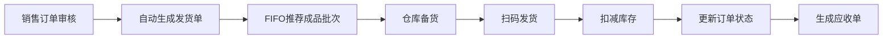
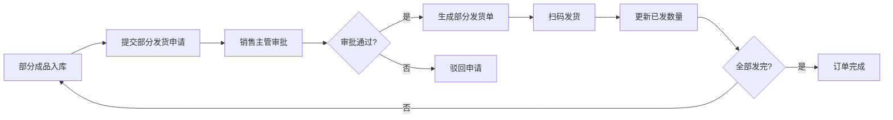
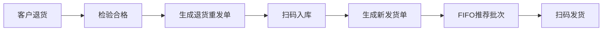

# 销售发货管理模块 详细设计

> 文档编号：VNERP-DESIGN-007  
> 版本：V1.0  
> 更新日期：2026-05-10

---

## 1. 模块概述

### 1.1 设计目标

销售发货是连接销售管理与仓库管理的核心环节，负责将成品从仓库转移到客户手中。本模块与销售订单管理、仓库管理、二维码追溯、财务管理模块深度集成，实现订单驱动、先进先出、扫码出库、自动关联追溯的全流程自动化管理，确保发货数量准确、产品质量可追溯、库存实时更新、订单状态同步。

### 1.2 核心能力

- **订单驱动**：所有发货必须关联销售订单，禁止无单发货
- **成品先进先出**：系统自动推荐最早入库的成品批次
- **扫码优先**：所有出库操作通过扫描成品二维码完成
- **全流程追溯**：发货记录与成品二维码关联
- **实时同步**：发货操作实时更新库存和订单状态

---

## 2. 核心设计原则

| 原则 | 说明 | 系统保障 |
|------|------|----------|
| 订单驱动 | 所有发货必须关联销售订单 | 发货单必须填写 sales_order_id |
| 成品先进先出 | 系统自动推荐最早入库的成品批次 | FIFO算法自动推荐 |
| 扫码优先 | 所有出库操作通过扫描成品二维码完成 | 必须扫码验证 |
| 全流程追溯 | 发货记录与成品二维码关联 | 自动建立追溯链 |
| 实时同步 | 发货操作实时更新库存和订单状态 | 事务保证 |

---

## 3. 发货类型与流程

### 3.1 发货类型定义

| 类型 | 说明 | 触发条件 |
|------|------|----------|
| 正常发货 | 销售订单正常执行的发货 | 销售订单审核通过且有可用库存 |
| 部分发货 | 订单数量未全部生产完成时的分批发货 | 部分成品已入库且客户同意分批发货 |
| 退货发货 | 客户退货后重新发货 | 客户退货检验合格或换货申请审批通过 |
| 补发发货 | 因少发、错发或质量问题的补发 | 客户反馈问题并经确认 |

### 3.2 正常发货流程



**详细流程：**

1. **自动生成发货单**：销售订单审核通过且有可用库存后，系统自动生成发货单
   - 发货单包含：订单编号、客户名称、产品清单、数量、仓库位置
   - 系统自动根据成品先进先出原则推荐发货批次

2. **仓库备货**：仓库管理员根据系统推荐的批次准备成品

3. **扫码发货**：仓库管理员扫描成品二维码进行出库
   - 系统自动校验二维码是否有效、是否已发货
   - 系统自动校验产品信息是否与发货单一致
   - 系统自动校验是否为推荐的先进先出批次

4. **确认发货**：确认无误后，系统自动扣减成品库存

5. **更新订单状态**：订单状态更新为 "已发货"

6. **生成追溯记录**：系统自动生成追溯记录，建立成品与销售订单、客户的关联

7. **通知客户**：系统自动发送发货通知给客户，包含物流信息

### 3.3 部分发货流程



**详细流程：**

1. **销售订单部分成品已入库后**，销售人员提交部分发货申请
2. **销售主管审批部分发货申请**
3. **审批通过后，生成部分发货单**
4. **仓库管理员按部分发货单扫码发货**
5. **系统更新订单已发货数量和库存数量**
6. **订单剩余数量待生产完成后继续发货**

### 3.4 退货重发流程



**详细流程：**

1. **客户退回成品并检验合格后**，系统生成退货重发单
2. **仓库管理员扫描退回成品的二维码进行入库**
3. **重新生成发货单**，按先进先出原则推荐批次
4. **扫码发货，更新库存和订单状态**

---

## 4. 数据结构设计

### 4.1 发货单主表（shipments）

| 字段名 | 类型 | 说明 |
|--------|------|------|
| id | bigint | 主键 |
| shipment_no | varchar(20) | 发货单编号，格式：SH+YYYYMMDD+4位序号 |
| sales_order_id | bigint | 关联销售订单 ID |
| type | varchar(10) | 发货类型：正常发货、部分发货、退货发货、补发发货 |
| status | varchar(20) | 状态：草稿、待审批、待发货、部分发货、已发货、已取消 |
| customer_id | bigint | 客户 ID |
| warehouse_id | bigint | 仓库 ID |
| total_quantity | decimal(10,2) | 发货总数量 |
| shipped_quantity | decimal(10,2) | 已发货数量 |
| logistics_company | varchar(50) | 物流公司 |
| tracking_no | varchar(50) | 物流单号 |
| applicant_id | bigint | 申请人 ID |
| approver_id | bigint | 审批人 ID |
| ship_time | datetime | 发货时间 |
| create_time | datetime | 创建时间 |
| update_time | datetime | 更新时间 |
| remark | text | 备注 |
| parent_shipment_id | bigint | 父发货单 ID（补发时关联） |

### 4.2 发货单明细表（shipment_items）

| 字段名 | 类型 | 说明 |
|--------|------|------|
| id | bigint | 主键 |
| shipment_id | bigint | 发货单 ID |
| material_id | bigint | 成品 ID |
| quantity | decimal(10,2) | 发货数量 |
| shipped_quantity | decimal(10,2) | 已发货数量 |
| unit | varchar(10) | 单位 |
| qr_code | varchar(20) | 成品二维码编码 |
| batch_no | varchar(50) | 成品批次号 |
| warehouse_location | varchar(50) | 库位 |

---

## 5. 核心接口设计

### 5.1 获取销售订单发货单

```http
GET /api/shipments/by-sales-order/{sales_order_id}
Authorization: Bearer {token}

Response:
{
  "code": 200,
  "message": "success",
  "data": {
    "shipment_no": "SH202605100001",
    "sales_order_no": "SO202605100001",
    "customer_name": "XX客户",
    "type": "正常发货",
    "status": "待发货",
    "total_quantity": 95,
    "items": [
      {
        "material_id": 2,
        "material_name": "丝网印刷产品A",
        "specification": "100×200mm",
        "quantity": 95,
        "unit": "pcs",
        "recommended_qr_codes": [
          "VNF202605100000001",
          "VNF202605100000002"
        ],
        "warehouse_location": "B-01-01"
      }
    ]
  }
}
```

### 5.2 扫码成品发货

```http
POST /api/shipments/{id}/ship
Content-Type: application/json
Authorization: Bearer {token}

{
  "items": [
    {
      "material_id": 2,
      "qr_code": "VNF202605100000001",
      "quantity": 1
    },
    {
      "material_id": 2,
      "qr_code": "VNF202605100000002",
      "quantity": 1
    }
  ],
  "logistics_company": "顺丰速运",
  "tracking_no": "SF1234567890"
}

Response:
{
  "code": 200,
  "message": "success",
  "data": {
    "shipment_no": "SH202605100001",
    "status": "已发货",
    "ship_time": "2026-05-10 16:30:00",
    "shipped_quantity": 95,
    "auto_receivable_no": "AR202605100001"
  }
}
```

### 5.3 提交部分发货申请

```http
POST /api/shipments/partial
Content-Type: application/json
Authorization: Bearer {token}

{
  "sales_order_id": 1,
  "quantity": 50,
  "remark": "先发货50件，剩余45件明天发货"
}
```

### 5.4 提交补发申请

```http
POST /api/shipments/re-ship
Content-Type: application/json
Authorization: Bearer {token}

{
  "parent_shipment_id": 1,
  "quantity": 5,
  "reason": "客户反馈少发5件"
}
```

---

## 6. 与其他模块的集成

| 模块 | 集成点 |
|------|--------|
| 销售订单模块 | 订单审核通过自动生成发货单，发货完成更新订单状态 |
| 仓库管理模块 | 发货实时扣减成品库存，更新库存台账 |
| 二维码追溯模块 | 扫码发货自动关联成品追溯信息，更新成品状态为 "已发货" |
| 财务管理模块 | 发货数据用于生成应收款和销售报表 |
| 客户管理模块 | 发货完成自动发送通知给客户 |

---

## 7. 异常处理

| 异常场景 | 处理方式 |
|----------|----------|
| 成品二维码重复 | 系统自动提示 "该成品已发货" 并禁止发货 |
| 成品信息与发货单不符 | 系统自动提示并禁止发货 |
| 非先进先出批次发货 | 系统自动提示并禁止发货，需提交异常申请 |
| 发货数量超过订单数量 | 系统自动提示并要求确认 |
| 二维码无法识别 | 支持手动输入成品编码进行操作 |
| 库存不足 | 系统提示库存不足，建议部分发货 |

---

## 8. 报表统计

- **发货明细报表**：按订单、客户、时间统计发货情况
- **订单发货及时率报表**：统计各订单的发货及时率
- **客户发货统计报表**：按客户统计发货数量和金额
- **物流费用统计报表**：统计各物流公司的物流费用
- **发货追溯报表**：统计发货成品的追溯情况
