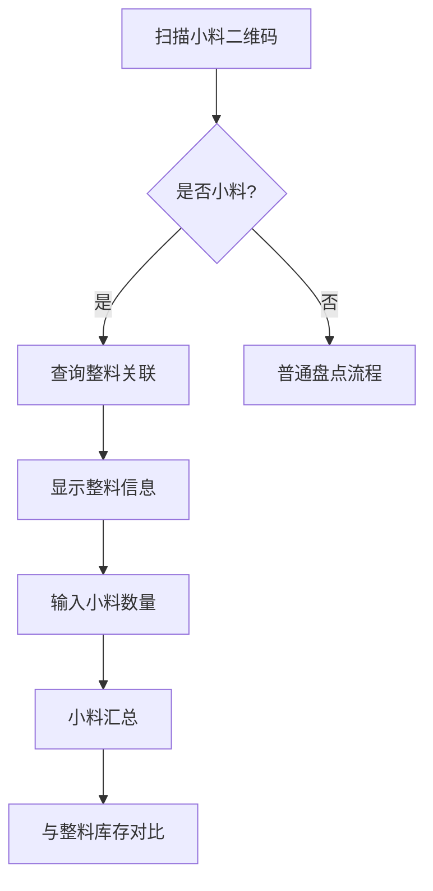
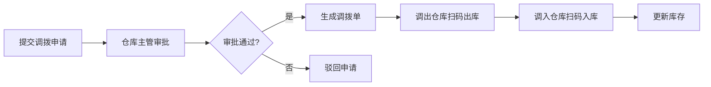

# 库存盘点与调拨管理模块 详细设计

> 文档编号：VNERP-DESIGN-015  
> 版本：V1.0  
> 更新日期：2026-05-10

---

## 1. 模块概述

### 1.1 设计目标

库存盘点是确保仓库账实相符的核心环节，负责定期或不定期对仓库内的物料和成品进行清点核对。本模块与仓库管理、二维码追溯、财务管理模块深度集成，结合小料拆分和先进先出原则，实现扫码盘点、自动计算差异、审批调整库存的全流程自动化管理，提高盘点效率和准确性，减少库存差异。

### 1.2 核心能力

- **扫码盘点**：所有盘点操作通过扫描二维码完成，自动识别物料信息和批次
- **账实分离**：盘点时系统锁定库存，禁止出入库操作
- **差异审批**：所有盘盈盘亏必须经审批后才能调整库存
- **全程追溯**：盘点记录与二维码关联，实现差异原因精准追溯
- **支持小料盘点**：针对拆分后的小料单元进行独立盘点

---

## 2. 核心设计原则

| 原则 | 说明 | 系统保障 |
|------|------|----------|
| 扫码盘点 | 所有盘点操作通过扫描二维码完成 | 必须扫码 |
| 账实分离 | 盘点时系统锁定库存 | stocktaking_flag=1 |
| 差异审批 | 盘盈盘亏必须经审批 | 差异>100需财务主管审批 |
| 全程追溯 | 盘点记录与二维码关联 | 自动记录 |
| 小料盘点 | 支持小料单元独立盘点 | 扫码识别split_flag |

---

## 3. 盘点类型与流程

### 3.1 盘点类型定义

| 类型 | 说明 | 执行频率 | 适用场景 |
|------|------|----------|----------|
| 定期盘点 | 按固定周期对所有库存进行全面盘点 | 每月 / 每季度 | 常规库存核对 |
| 不定期盘点 | 根据需要随时进行的全面盘点 | 按需 | 仓库人员变动、重大差异后 |
| 循环盘点 | 按物料类别或库位轮流进行盘点 | 每日 / 每周 | 高价值物料、易损耗物料 |
| 抽盘 | 对部分物料进行随机抽查盘点 | 每周 | 日常库存监控 |

### 3.2 全面盘点流程


**详细流程：**

1. **生成盘点单**：仓库管理员在系统中生成盘点单
   - 选择盘点范围：全部仓库、指定仓库、指定物料类别

2. **锁定库存**：系统自动锁定盘点范围内的库存，禁止出入库操作
   - 设置 `stocktaking_flag = 1`

3. **生成盘点清单**：系统生成盘点清单，包含所有物料的二维码、批次、库位、账面数量

4. **扫码盘点**：盘点人员扫描物料二维码进行盘点
   - 系统自动识别物料信息和批次
   - 输入实际盘点数量
   - 系统自动对比账面数量和实际数量，标记差异

5. **提交盘点结果**：盘点完成后，提交盘点结果

6. **差异处理**：
   - 系统自动生成盘盈盘亏表
   - 仓库管理员核实差异原因并记录
   - 提交差异处理申请给财务主管审批（差异>100）

7. **调整库存**：审批通过后，系统自动调整库存数量

8. **解锁库存**：盘点完成后，系统解锁库存，恢复出入库操作

### 3.3 小料盘点特殊说明



**小料盘点要点：**

- 盘点时必须扫描每个小料单元的二维码，精确到每一个小料
- 整料盘点时，系统自动显示该整料已拆分的小料数量和剩余数量
- 余料单独盘点，生成余料盘点记录
- 盘点差异精确到每个小料批次，便于追溯差异原因

---

## 4. 调拨流程设计

### 4.1 调拨类型定义

| 类型 | 说明 |
|------|------|
| 库位调拨 | 同一仓库内不同库位之间的物料转移 |
| 仓库调拨 | 不同仓库之间的物料转移 |

### 4.2 调拨流程



**详细流程：**

1. **仓库管理员提交调拨申请**，填写调拨物料、数量、调出库位、调入库位
2. **仓库主管审批调拨申请**
3. **审批通过后，生成调拨单**
4. **调出仓库扫描物料二维码进行出库**
5. **调入仓库扫描物料二维码进行入库**
6. **系统自动更新调出和调入库位的库存数量**
7. **生成调拨记录，更新物料追溯信息**

---

## 5. 数据结构设计

### 5.1 盘点单主表（inventory_checks）

| 字段名 | 类型 | 说明 |
|--------|------|------|
| id | bigint | 主键 |
| check_no | varchar(20) | 盘点单编号，格式：IC+YYYYMMDD+4位序号 |
| type | varchar(10) | 盘点类型：定期盘点、不定期盘点、循环盘点、抽盘 |
| warehouse_id | bigint | 仓库 ID |
| status | smallint | 状态：0=草稿，1=进行中，2=待审批，3=已完成，4=已取消 |
| start_time | datetime | 开始时间 |
| end_time | datetime | 结束时间 |
| checker_id | bigint | 盘点人 ID |
| approver_id | bigint | 审批人 ID |
| total_items | int | 盘点项总数 |
| diff_items | int | 差异项数 |
| diff_amount | decimal(12,2) | 差异金额 |
| create_time | datetime | 创建时间 |
| update_time | datetime | 更新时间 |
| remark | text | 备注 |

### 5.2 盘点单明细表（inventory_check_items）

| 字段名 | 类型 | 说明 |
|--------|------|------|
| id | bigint | 主键 |
| check_id | bigint | 盘点单 ID |
| material_id | bigint | 物料 ID |
| qr_code | varchar(20) | 二维码编码 |
| batch_no | varchar(50) | 批次号 |
| warehouse_location | varchar(50) | 库位 |
| split_flag | smallint | 拆分标识：0=整料，1=小料，2=余料 |
| parent_qr_code | varchar(20) | 父二维码（小料关联整料） |
| book_quantity | decimal(10,2) | 账面数量 |
| actual_quantity | decimal(10,2) | 实际数量 |
| difference | decimal(10,2) | 差异数量 |
| difference_reason | varchar(200) | 差异原因 |
| status | smallint | 状态：0=未盘点，1=已盘点，2=已调整 |

### 5.3 调拨单主表（transfers）

| 字段名 | 类型 | 说明 |
|--------|------|------|
| id | bigint | 主键 |
| transfer_no | varchar(20) | 调拨单编号，格式：TR+YYYYMMDD+4位序号 |
| type | varchar(10) | 调拨类型：库位调拨、仓库调拨 |
| from_warehouse_id | bigint | 调出仓库 ID |
| to_warehouse_id | bigint | 调入仓库 ID |
| from_location | varchar(50) | 调出库位 |
| to_location | varchar(50) | 调入库位 |
| status | smallint | 状态：0=草稿，1=待审批，2=已出库，3=已入库，4=已取消 |
| applicant_id | bigint | 申请人 ID |
| approver_id | bigint | 审批人 ID |
| out_time | datetime | 出库时间 |
| in_time | datetime | 入库时间 |
| create_time | datetime | 创建时间 |
| update_time | datetime | 更新时间 |
| remark | text | 备注 |

---

## 6. 核心接口设计

### 6.1 生成盘点单

```http
POST /api/inventory-checks
Content-Type: application/json
Authorization: Bearer {token}

{
  "type": "定期盘点",
  "warehouse_id": 1,
  "remark": "5月份月度盘点"
}

Response:
{
  "code": 200,
  "message": "success",
  "data": {
    "check_no": "IC202605100001",
    "status": "进行中",
    "item_count": 120,
    "locked": true
  }
}
```

### 6.2 扫码盘点

```http
POST /api/inventory-checks/{id}/scan
Content-Type: application/json
Authorization: Bearer {token}

{
  "qr_code": "VNR202605100000001",
  "actual_quantity": 8
}

Response:
{
  "code": 200,
  "message": "success",
  "data": {
    "material_name": "PET薄膜",
    "batch_no": "RM20260510001",
    "split_flag": "小料",
    "parent_qr_code": "VNR202605100000000",
    "book_quantity": 10,
    "actual_quantity": 8,
    "difference": -2
  }
}
```

### 6.3 小料汇总查询

```http
GET /api/inventory-checks/{id}/split-summary?parent_qr_code=VNR202605100000000
Authorization: Bearer {token}

Response:
{
  "code": 200,
  "message": "success",
  "data": {
    "parent_qr_code": "VNR202605100000000",
    "material_name": "PET薄膜",
    "batch_no": "RM20260510001",
    "whole_material_book_qty": 100,
    "whole_material_actual_qty": 100,
    "split_small_qty": 10,
    "split_remainder_qty": 2,
    "small_materials": [
      {
        "qr_code": "VNR202605100000001",
        "book_quantity": 10,
        "actual_quantity": 8
      }
    ],
    "total_small_book_qty": 80,
    "total_small_actual_qty": 78,
    "difference": -2
  }
}
```

### 6.4 提交盘点结果

```http
PUT /api/inventory-checks/{id}/submit
Content-Type: application/json
Authorization: Bearer {token}

{
  "items": [
    {
      "id": 1,
      "difference_reason": "生产损耗未记录"
    },
    {
      "id": 2,
      "difference_reason": "盘点错误"
    }
  ]
}
```

### 6.5 差异审批

```http
PATCH /api/inventory-checks/{id}/approve-diff
Content-Type: application/json
Authorization: Bearer {token}

{
  "action": "approve",
  "remark": "差异已核实，同意调整"
}
```

---

## 7. 与其他模块的集成

| 模块 | 集成点 |
|------|--------|
| 仓库管理模块 | 盘点时锁定库存，审批通过后自动调整库存 |
| 二维码追溯模块 | 扫码盘点自动识别物料信息和批次，更新物料状态 |
| 财务管理模块 | 盘盈盘亏数据用于财务核算和成本调整 |
| 采购管理模块 | 盘点发现库存不足时自动生成采购申请 |

---

## 8. 异常处理

| 异常场景 | 处理方式 |
|----------|----------|
| 盘点时库存变动 | 系统自动锁定库存，禁止盘点期间的出入库操作 |
| 二维码无法识别 | 支持手动输入物料编码和批次号进行盘点 |
| 差异过大 | 系统自动预警并要求重新盘点 |
| 未完成盘点 | 系统禁止提交盘点结果和解锁库存 |
| 调拨物料不存在 | 系统自动提示并禁止调拨 |
| 小料与整料数量不匹配 | 系统提示差异，需核实原因 |

---

## 9. 报表统计

- **盘点明细报表**：显示每次盘点的详细情况
- **盘盈盘亏报表**：统计各物料的盘盈盘亏情况
- **差异原因分析报表**：统计各类差异原因的占比
- **库存准确率报表**：统计仓库的库存准确率
- **小料盘点汇总报表**：按整料汇总小料盘点情况
