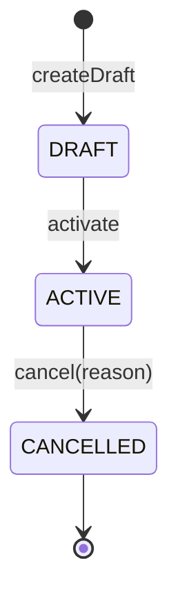
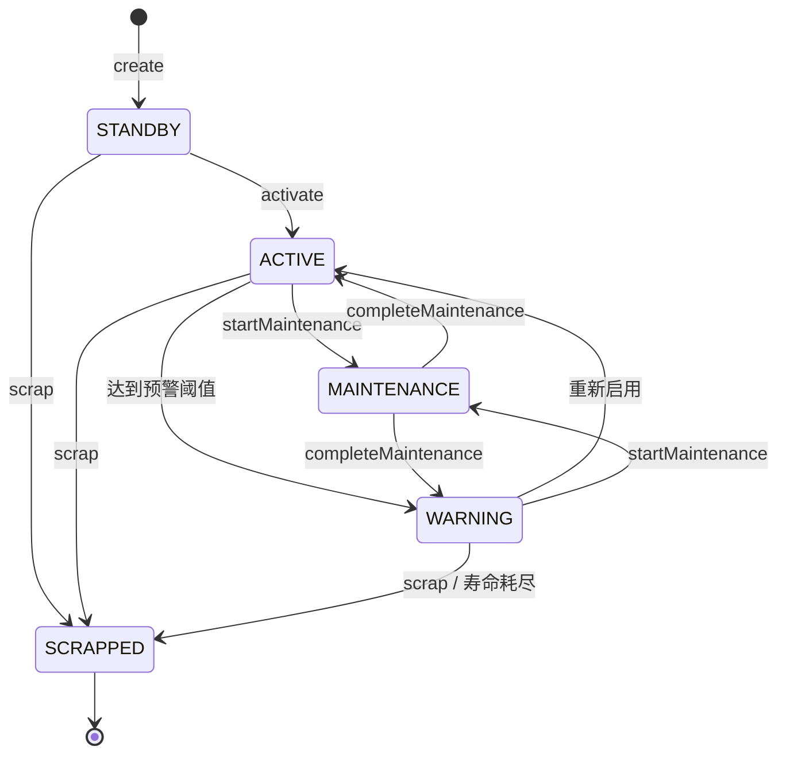
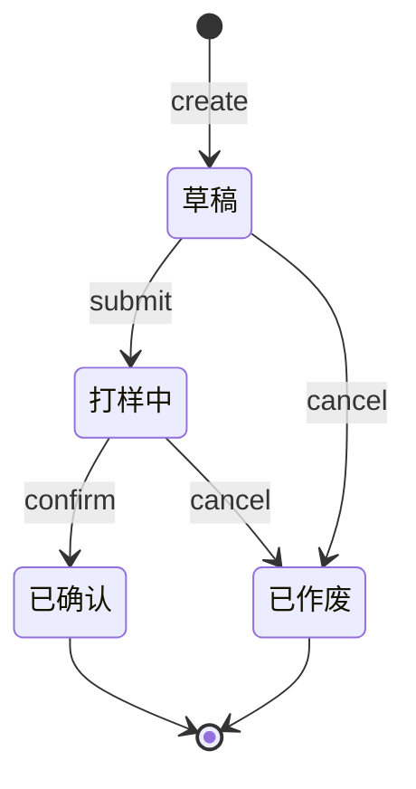

# 印前模块文档

## 1. 概述

印前模块（dcprint 域）负责印刷生产前的工艺准备工作，包含三大核心聚合根：

- **油墨配方版本（InkFormulaVersion）**：管理色号对应的油墨配方版本，支持版本复用、成本快照、生效/作废流转
- **工装（Tool）**：管理刀模与网版的全生命周期，含寿命追踪、成本摊销、维修与报废
- **打样工艺卡（SampleProcessCard）**：定义打样产品的物料明细、工序明细与成本估算，确认后可联动生成打样工单

本模块是 DDD 落地较完整的模块之一，包含聚合根、值对象、领域事件、仓储接口与应用服务完整分层。

> **依据**：`docs/油墨配方版本管理完整落地方案.md`、`docs/刀模 _ 网版工装全生命周期管理 完整落地方案.md`、`docs/打样工艺卡录入页统一完善方案.md`

## 2. 架构分层

```
src/app/api/dcprint/formula/version/route.ts                 表现层（withPermission）
src/app/api/dcprint/tool/route.ts
src/app/api/dcprint/sample-card/route.ts
        ↓
src/application/services/InkFormulaVersionService.ts         应用层（用例编排 + 事务 + Outbox）
src/application/handlers/FormulaVersionEventHandler.ts       事件处理器
        ↓
src/domain/dcprint/aggregates/InkFormulaVersion.ts           领域层（聚合根）
src/domain/dcprint/aggregates/Tool.ts
src/domain/dcprint/aggregates/SampleProcessCard.ts
src/domain/dcprint/value-objects/FormulaStatus.ts            值对象（状态机）
src/domain/dcprint/value-objects/ToolStatus.ts
src/domain/dcprint/value-objects/FormulaItemVO.ts
src/domain/dcprint/events/FormulaVersionEvents.ts            领域事件
src/domain/dcprint/events/ToolEvents.ts
src/domain/dcprint/events/ProcessCardEvents.ts
src/domain/dcprint/repositories/IFormulaVersionRepository.ts 仓储接口
        ↓
src/infrastructure/repositories/Mysql*Repository.ts          基础设施层（仓储实现）
```

## 3. 领域模型

### 3.1 聚合根：InkFormulaVersion（油墨配方版本）

文件：`src/domain/dcprint/aggregates/InkFormulaVersion.ts`

封装核心业务规则：状态流转、版本号生成、一键复用、成本快照、明细校验。

| 属性 | 类型 | 说明 |
|---|---|---|
| `id` | number | 主键 |
| `colorId` | number | 关联色号 ID（必填） |
| `versionNo` | string | 版本号，格式 `V主.次`（如 `V1.0`、`V2.3`，必填） |
| `versionName` | string \| null | 版本名称 |
| `status` | FormulaStatus | 状态：草稿/已生效/已作废 |
| `changeReason` | string \| null | 变更原因 |
| `sourceVersionId` | number \| null | 一键复用时的源版本 ID |
| `processNote` | string \| null | 工艺说明 |
| `totalWeight` | number \| null | 总重量 |
| `unit` | string | 单位（默认 `kg`） |
| `shelfLifeHours` | number | 保质期小时（默认 168） |
| `theoreticalCost` | number \| null | 理论成本（生效时快照） |
| `costSnapshotTime` | Date \| null | 成本快照时间 |
| `costCalcStatus` | number | 成本计算状态：0 未计算 / 1 完成 / 2 部分缺失 |
| `costWarning` | string \| null | 成本警告信息 |
| `activateBy` / `activateTime` | - | 生效操作人与时间 |
| `cancelBy` / `cancelReason` / `cancelTime` | - | 作废信息 |
| `items` | FormulaItemVO[] | 配方明细列表 |

**核心方法**：

| 方法 | 职责 |
|---|---|
| `activate(operatorId)` | 版本生效（草稿 → 已生效），触发 `FormulaVersionActivatedEvent` |
| `cancel(operatorId, reason)` | 版本作废（已生效 → 已作废），作废原因必填，触发 `FormulaVersionCancelledEvent` |
| `updateItems(newItems)` | 更新明细（仅草稿可操作），重置成本状态 |
| `updateBaseInfo(data)` | 更新基础信息（仅草稿可操作） |
| `snapshotCost(costResult)` | 固化成本快照（生效时调用） |
| `createDraft(...)` | 工厂方法：创建草稿版本 |
| `duplicateFrom(source, options, operatorId)` | 工厂方法：一键复用，复制源版本全部明细与工艺参数 |
| `generateNextVersionNo(current, majorBump)` | 静态方法：生成下一版本号（主版本+1 或次版本+1） |

**版本号规则**：
- 格式：`V主.次`，正则 `^V\d+\.\d+$`
- 次版本升级：`V1.2` → `V1.3`
- 主版本升级：`V1.2` → `V2.0`
- 一键复用时默认次版本+1，`majorVersion=true` 时主版本+1

### 3.2 聚合根：Tool（工装 - 刀模/网版）

文件：`src/domain/dcprint/aggregates/Tool.ts`

工装支持两套体系字段：体系B（刀模）与体系C（网版），统一管理寿命、成本与状态。

| 属性分组 | 字段 | 说明 |
|---|---|---|
| **基础** | `toolType` / `toolCode` / `toolName` / `spec` | 类型、编码、名称、规格 |
| **寿命** | `totalLife` / `usedCount` / `remainLife` / `warningThreshold` | 总寿命、已用、剩余、预警阈值 |
| **成本** | `originalCost` / `accumulatedCost` / `netValue` / `unitCost` | 原值、累计摊销、净值、单位成本 |
| **状态** | `status` | ToolStatus（5 态） |
| **体系B（刀模）** | `assetType` / `layoutType` / `piecesPerImpression` / `material` / `qrCode` / `supplierId` / `maintenanceInterval` / `maintenanceCount` / `lastMaintenanceDate` / `lastMaintenanceImpressions` / `lastUsedDate` | 刀模专属字段 |
| **体系C（网版）** | `meshCount` / `meshMaterial` / `size` / `tensionValue` / `frameType` / `customerId` / `reclaimCount` / `exposureDate` / `lastCleanDate` / `lastReclaimDate` / `tensionDate` | 网版专属字段 |
| **报废** | `scrapReason` / `scrapTime` / `scrapBy` | 报废信息 |

**核心方法**：

| 方法 | 职责 |
|---|---|
| `recordUsage(useCount, context)` | 记录使用：累计已用、扣减剩余、摊销成本、自动状态流转、触发 `ToolUsedEvent` 与 `ToolWarningTriggeredEvent` |
| `activate()` | 激活（待用 → 在用） |
| `startMaintenance()` | 开始维修（在用/预警 → 维修中） |
| `completeMaintenance(maintenanceCost, lifeAfter)` | 完成维修：重算净值/原值/单位成本，恢复在用或预警状态 |
| `scrap(reason, operatorId)` | 报废：触发 `ToolScrappedEvent` |
| `create(input)` | 工厂方法：创建工装（初始状态为待用，单位成本=原值/总寿命） |

**寿命与成本规则**：
- `unitCost = originalCost / totalLife`
- 每次使用：`amortizedCost = unitCost × useCount`，`netValue = originalCost - accumulatedCost`
- 剩余寿命 ≤ 0 时自动转为已报废
- 已用次数 ≥ 预警阈值时转为预警状态
- 仅在用/预警状态可记录使用

### 3.3 聚合根：SampleProcessCard（打样工艺卡）

文件：`src/domain/dcprint/aggregates/SampleProcessCard.ts`

打样工艺卡承载物料明细与工序明细，确认后可联动生成打样工单。

| 属性 | 说明 |
|---|---|
| `sampleNo` / `sampleName` | 打样编号、名称（必填） |
| `customerId` / `customerName` | 客户 |
| `productId` / `productName` | 产品 |
| `versionNo` | 版本号（默认 `V1.0`） |
| `status` | CardStatus：1 草稿 / 2 打样中 / 3 已确认 / 4 已作废 |
| `substrateMaterialId` / `substrateMaterialName` | 承印物 |
| `spec` / `printColor` | 规格、印刷颜色 |
| `inkColorId` / `screenPlateId` / `dieToolId` | 关联油墨色号、网版、刀模 |
| `materialLossRate` | 物料损耗率（默认 5） |
| `estimatedHour` | 预估工时 |
| `totalMaterialCost` / `totalLaborCost` / `totalToolCost` / `totalCost` | 成本汇总 |
| `diagramUrl` | 图纸 URL |
| `sampleWorkOrderId` / `sampleWorkOrderNo` | 关联打样工单 |
| `quoteId` | 关联报价单 |
| `formalWorkOrderId` | 关联正式工单 |
| `sourceVersionId` | 源版本 ID |
| `items` | 物料明细（SampleProcessItemProps[]） |
| `steps` | 工序明细（SampleProcessStepProps[]） |

**核心方法**：

| 方法 | 职责 |
|---|---|
| `submit()` | 提交（草稿 → 打样中） |
| `confirm(confirmBy)` | 确认（打样中 → 已确认），触发 `ProcessCardConfirmedEvent` |
| `cancel()` | 作废（草稿/打样中 → 已作废） |
| `updateCosts(material, labor, tool)` | 更新成本汇总（4 位小数精度） |
| `create(props)` | 工厂方法：创建工艺卡（需至少 1 条物料明细 + 1 条工序明细） |

## 4. 值对象与状态机

### 4.1 FormulaStatus（配方状态 - 3 态）

文件：`src/domain/dcprint/value-objects/FormulaStatus.ts`

| 枚举值 | 数值 | 标签 | 颜色 |
|---|---|---|---|
| `DRAFT` | 1 | 草稿 | gray |
| `ACTIVE` | 2 | 已生效 | green |
| `CANCELLED` | 3 | 已作废 | red |

**状态流转**：



| 当前状态 | 允许流转到 |
|---|---|
| `DRAFT` | `ACTIVE` |
| `ACTIVE` | `CANCELLED` |
| `CANCELLED` | （终态） |

**辅助函数**：`canTransition(from, to)`、`getStatusLabel(status)`、`getStatusColor(status)`、`isEditable(status)`（仅草稿可编辑）、`isUsableForProduction(status)`（仅已生效可用于生产）。

### 4.2 ToolStatus（工装状态 - 5 态）

文件：`src/domain/dcprint/value-objects/ToolStatus.ts`

| 枚举值 | 数值 | 标签 | 颜色 |
|---|---|---|---|
| `STANDBY` | 1 | 待用 | default |
| `ACTIVE` | 2 | 在用 | success |
| `MAINTENANCE` | 3 | 维修中 | warning |
| `WARNING` | 4 | 预警 | error |
| `SCRAPPED` | 5 | 已报废 | default |

**状态流转**：



| 当前状态 | 允许流转到 |
|---|---|
| `STANDBY` | `ACTIVE`, `SCRAPPED` |
| `ACTIVE` | `MAINTENANCE`, `WARNING`, `SCRAPPED` |
| `MAINTENANCE` | `ACTIVE`, `WARNING` |
| `WARNING` | `ACTIVE`, `MAINTENANCE`, `SCRAPPED` |
| `SCRAPPED` | （终态） |

**辅助函数**：`canToolTransition(from, to)`、`getToolStatusLabel(status)`、`getToolStatusColor(status)`、`isToolUsable(status)`（仅在用/预警可用）。

### 4.3 CardStatus（工艺卡状态 - 4 态）

定义于 `SampleProcessCard` 聚合根内，类型 `1 | 2 | 3 | 4`。

| 数值 | 标签 |
|---|---|
| 1 | 草稿 |
| 2 | 打样中 |
| 3 | 已确认 |
| 4 | 已作废 |



**操作权限**：
- `canEdit` / `canDelete` / `canSubmit`：仅草稿（1）
- `canConfirm`：仅打样中（2）
- `canCancel`：草稿（1）或打样中（2）

## 5. 领域事件

### 5.1 配方版本事件

文件：`src/domain/dcprint/events/FormulaVersionEvents.ts`

| 事件类 | eventType | 触发时机 | 载荷 |
|---|---|---|---|
| `FormulaVersionActivatedEvent` | `inkFormulaVersion.activated` | 草稿版本被激活为已生效 | versionId, colorId, versionNo, activatedBy, theoreticalCost |
| `FormulaVersionCancelledEvent` | `inkFormulaVersion.cancelled` | 已生效版本被作废 | versionId, colorId, versionNo, cancelledBy, reason |

### 5.2 工装事件

文件：`src/domain/dcprint/events/ToolEvents.ts`

| 事件类 | eventType | 触发时机 |
|---|---|---|
| `ToolCreatedEvent` | `tool.created` | 新工装录入完成 |
| `ToolActivatedEvent` | `tool.activated` | 工装从待用变为在用 |
| `ToolMaintenanceStartedEvent` | `tool.maintenance_started` | 工装进入维修状态 |
| `ToolMaintenanceCompletedEvent` | `tool.maintenance_completed` | 工装维修完成 |
| `ToolWarningTriggeredEvent` | `tool.warning_triggered` | 使用累计达到预警阈值 |
| `ToolScrappedEvent` | `tool.scrapped` | 工装被报废（手动或寿命耗尽） |
| `ToolUsedEvent` | `tool.used` | 报工审核时联动累计刀模/网版使用次数 |

### 5.3 工艺卡事件

文件：`src/domain/dcprint/events/ProcessCardEvents.ts`

| 事件类 | eventType | 触发时机 |
|---|---|---|
| `ProcessCardConfirmedEvent` | `process_card.confirmed` | 工艺卡确认（可联动生成打样工单） |

### 5.4 事件处理器注册

文件：`src/application/EventRegistry.ts`

| eventType | 处理器 |
|---|---|
| `inkFormulaVersion.activated` | `FormulaVersionActivatedHandler`（幂等）、`AuditLogHandler`、`CacheInvalidationHandler` |
| `inkFormulaVersion.cancelled` | `FormulaVersionCancelledHandler`（幂等）、`AuditLogHandler`、`CacheInvalidationHandler` |
| `tool.created` / `tool.activated` / `tool.maintenance_*` / `tool.warning_triggered` / `tool.scrapped` | `AuditLogHandler`、`CacheInvalidationHandler` |
| `tool.used` | 由 `WorkReportApprovedEvent` 链路触发，联动 `ToolUsageSyncHandler` |

## 6. API 接口

### 6.1 油墨配方版本 API

| 方法 | 路径 | 功能 |
|---|---|---|
| GET | `/api/dcprint/formula/version?colorId=` | 按色号查询版本列表 |
| GET | `/api/dcprint/formula/version?id=` | 获取版本详情 |
| GET | `/api/dcprint/formula/version?compare=1&leftId=&rightId=` | 版本对比 |
| POST | `/api/dcprint/formula/version` | 新建草稿版本 |
| POST | `/api/dcprint/formula/version?previewCost=1` | 成本预览 |
| PUT | `/api/dcprint/formula/version/[id]` | 更新版本基础信息 |
| PUT | `/api/dcprint/formula/version/[id]/items` | 更新配方明细 |
| PUT | `/api/dcprint/formula/version/[id]/activate` | 版本生效 |
| PUT | `/api/dcprint/formula/version/[id]/cancel` | 版本作废 |
| POST | `/api/dcprint/formula/version/[id]/duplicate` | 一键复用 |
| GET | `/api/dcprint/formula/version/[id]/preview-cost` | 单版本成本预览 |
| PUT | `/api/dcprint/formula/version/[id]/recalculate-cost` | 重算成本 |
| GET | `/api/dcprint/formula/version/compare` | 版本对比（独立端点） |
| GET | `/api/dcprint/formula/color` | 色号管理 |

### 6.2 工装 API

| 方法 | 路径 | 功能 |
|---|---|---|
| GET | `/api/dcprint/tool` | 工装列表查询（支持类型/状态/关键字筛选） |
| POST | `/api/dcprint/tool` | 创建工装 |
| GET | `/api/dcprint/tool/[id]` | 工装详情 |
| PUT | `/api/dcprint/tool/[id]` | 更新工装 |
| PUT | `/api/dcprint/tool/[id]/activate` | 激活工装 |
| PUT | `/api/dcprint/tool/[id]/scrap` | 报废工装 |
| PUT | `/api/dcprint/tool/[id]/maintenance` | 维修工装（开始/完成） |
| POST | `/api/dcprint/tool/[id]/usage` | 记录使用 |
| GET | `/api/dcprint/tool/dashboard` | 工装看板（寿命预警、状态统计） |

### 6.3 工艺卡 API

| 方法 | 路径 | 功能 |
|---|---|---|
| GET | `/api/dcprint/sample-card` | 工艺卡列表 |
| POST | `/api/dcprint/sample-card` | 创建工艺卡 |
| GET | `/api/dcprint/sample-card/[id]` | 工艺卡详情 |
| PUT | `/api/dcprint/sample-card/[id]` | 更新工艺卡（仅草稿） |
| PUT | `/api/dcprint/sample-card/[id]/submit` | 提交工艺卡 |
| PUT | `/api/dcprint/sample-card/[id]/confirm` | 确认工艺卡 |
| PUT | `/api/dcprint/sample-card/[id]/cancel` | 作废工艺卡 |
| POST | `/api/dcprint/sample-card/[id]/duplicate` | 复制工艺卡 |
| POST | `/api/dcprint/sample-card/[id]/save-as-template` | 另存为模板 |
| POST | `/api/dcprint/sample-card/[id]/convert-work-order` | 转打样工单 |
| GET | `/api/dcprint/sample-card/[id]/cost-variance` | 成本差异分析 |
| GET | `/api/dcprint/sample-card/[id]/generate-quote` | 生成报价单 |
| POST | `/api/dcprint/sample-card/cost-preview` | 成本预览 |
| GET/POST | `/api/dcprint/sample-card/template` | 模板管理 |
| GET/PUT/DELETE | `/api/dcprint/sample-card/template/[id]` | 模板详情 |

### 6.4 其他印前 API

| 路径前缀 | 功能 |
|---|---|
| `/api/dcprint/ink-formula` | 油墨配方（旧版） |
| `/api/dcprint/ink-*` | 油墨相关（消耗、用量、余量、查询、期初、混合、派工、初始化） |
| `/api/dcprint/die` / `/api/dcprint/die-template` / `/api/dcprint/die-usage` / `/api/dcprint/die-maintenance` | 刀模管理 |
| `/api/dcprint/screen-plate` | 网版管理 |
| `/api/dcprint/process-cards` | 旧版工艺卡 |
| `/api/dcprint/labels` | 标签 |
| `/api/dcprint/scan` | 扫码 |
| `/api/dcprint/trace` | 追溯 |
| `/api/dcprint/ink-consumption` | 油墨消耗 |

## 7. 关键文件清单

| 文件 | 说明 |
|---|---|
| `src/domain/dcprint/aggregates/InkFormulaVersion.ts` | 油墨配方版本聚合根 |
| `src/domain/dcprint/aggregates/Tool.ts` | 工装聚合根（刀模/网版） |
| `src/domain/dcprint/aggregates/SampleProcessCard.ts` | 打样工艺卡聚合根 |
| `src/domain/dcprint/aggregates/SampleProcessTemplate.ts` | 工艺卡模板 |
| `src/domain/dcprint/value-objects/FormulaStatus.ts` | 配方状态机（3 态） |
| `src/domain/dcprint/value-objects/ToolStatus.ts` | 工装状态机（5 态） |
| `src/domain/dcprint/value-objects/FormulaItemVO.ts` | 配方明细值对象 |
| `src/domain/dcprint/events/FormulaVersionEvents.ts` | 配方版本事件（2 个） |
| `src/domain/dcprint/events/ToolEvents.ts` | 工装事件（7 个） |
| `src/domain/dcprint/events/ProcessCardEvents.ts` | 工艺卡事件（1 个） |
| `src/domain/dcprint/repositories/IFormulaVersionRepository.ts` | 配方仓储接口 |
| `src/domain/dcprint/repositories/IToolRepository.ts` | 工装仓储接口 |
| `src/domain/dcprint/repositories/ISampleProcessCardRepository.ts` | 工艺卡仓储接口 |
| `src/domain/dcprint/repositories/ISampleProcessTemplateRepository.ts` | 模板仓储接口 |
| `src/domain/dcprint/services/FormulaCompareService.ts` | 配方对比服务 |
| `src/domain/dcprint/services/FormulaCostService.ts` | 配方成本服务 |
| `src/application/services/InkFormulaVersionService.ts` | 配方版本应用服务 |
| `src/application/handlers/FormulaVersionEventHandler.ts` | 配方事件处理器 |

> 最后更新：2026-07-15
