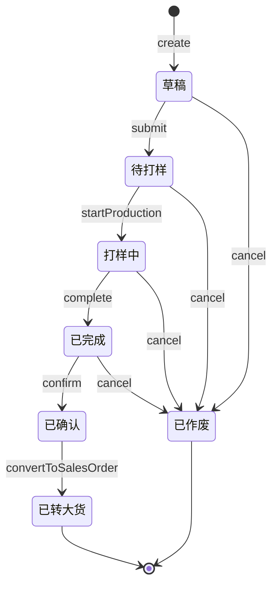

# 打样模块文档

## 1. 概述

打样模块（sample 域）负责打样订单的全生命周期管理，是连接客户需求与正式大货生产的关键桥梁。核心聚合根为 **SampleOrder（打样单）**，承载 7 态状态机，支持从草稿创建、提交打样、生产、完成、客户确认到一键转大货订单的完整流程。

打样模块的核心价值：
- **打样费管理**：支持打样费收取、可抵扣标记，转大货时自动抵扣
- **关联管理**：可关联工艺卡（processCardId）、打样工单（workOrderId）、销售订单（salesOrderId）
- **版本管理**：支持 sampleVersion 与 parentVersionId，承载打样迭代
- **T305 一键转大货**：已确认状态可自动生成销售订单并完成转化

> **依据**：`docs/13-分析报告/印前打样生产模块完善总结报告-2026-07-14.md`、`docs/05-测试文档/打样管理模块单元测试报告.md`、`docs/prototypes/sample-order-flow-prototype.html`、`database/migrations/053_enhance_sample_order.sql`

## 2. 架构分层

```
src/app/api/sample/orders/route.ts                          表现层（withPermission）
src/app/api/sample/orders/status/route.ts
src/app/api/sample/orders/linkage/route.ts
src/app/api/sample/feedback/route.ts
src/app/api/sample/inventory/route.ts
        ↓
src/application/services/SampleOrderApplicationService.ts   应用层（用例编排 + 事务 + Outbox）
src/application/handlers/SampleOrderInventoryHandler.ts     事件处理器
src/application/handlers/SampleOrderConversionHandler.ts
        ↓
src/domain/sample/aggregates/SampleOrder.ts                 领域层（聚合根）
src/domain/sample/entities/SampleFeedback.ts                领域实体
src/domain/sample/entities/SampleInventory.ts
src/domain/sample/value-objects/SampleOrderStatus.ts        值对象（7 态状态机）
src/domain/sample/events/SampleOrderEvents.ts               领域事件（7 个）
src/domain/sample/repositories/ISampleOrderRepository.ts    仓储接口
src/domain/sample/repositories/ISampleFeedbackRepository.ts
        ↓
src/infrastructure/repositories/MysqlSampleOrderRepository.ts  基础设施层（仓储实现）
```

## 3. 领域模型

### 3.1 聚合根：SampleOrder（打样单）

文件：`src/domain/sample/aggregates/SampleOrder.ts`

打样单聚合根封装状态流转、关联管理与费用处理规则，与 `sal_sample_order` 表一一对齐。

| 属性分组 | 字段 | 说明 |
|---|---|---|
| **基础** | `id` / `orderNo` | 主键、打样单号（格式 `SP + YYYYMMDD + 4位序号`） |
| **客户/产品** | `customerId` / `customerName` / `productName` / `materialNo` | 客户与产品信息 |
| **规格** | `version` / `sizeSpec` / `materialSpec` / `specification` / `quantity` | 版本（默认 `A`）、规格、数量 |
| **日期** | `notifyDate` / `orderDate` / `customerRequireDate` / `deliveryDate` / `actualDeliveryDate` | 通知、下单、要求交期、计划/实际交货日期 |
| **状态** | `status` / `deliveryStatus` | 打样状态（7 态）、交货状态（默认 `pending`） |
| **关联** | `processCardId` / `workOrderId` / `salesOrderId` | 工艺卡、工单、销售订单关联 |
| **费用** | `sampleFee` / `feeCharged` / `feeDeductible` / `feeDeducted` | 打样费、是否已收取、是否可抵扣、是否已抵扣 |
| **版本** | `sampleVersion` / `parentVersionId` | 打样版本号、父版本 ID |
| **转化** | `convertedAt` / `convertedBy` | 转大货时间与操作人 |
| **审计** | `createBy` / `createTime` / `updateTime` / `remark` | 创建人、时间戳、备注 |

**核心方法**：

| 方法 | 职责 | 状态流转 | 触发事件 |
|---|---|---|---|
| `submit(userId)` | 提交打样 | 草稿 → 待打样 | `SampleOrderSubmittedEvent` |
| `startProduction(userId)` | 开始打样生产 | 待打样 → 打样中 | `SampleOrderStartedEvent` |
| `complete(userId)` | 完成打样 | 打样中 → 已完成 | `SampleOrderCompletedEvent` |
| `confirm(userId)` | 客户确认 | 已完成 → 已确认 | `SampleOrderConfirmedEvent` |
| `convertToSalesOrder(salesOrderId, userId)` | 转大货 | 已确认 → 已转大货 | `SampleOrderConvertedEvent` |
| `cancel(reason, userId)` | 作废 | 多状态 → 已作废 | `SampleOrderCancelledEvent` |
| `linkProcessCard(processCardId)` | 关联工艺卡 | - | - |
| `linkWorkOrder(workOrderId)` | 关联工单 | - | - |
| `updateSampleFee(fee, charged, deductible)` | 更新打样费 | - | - |

**工厂方法**：
- `create(props)`：创建打样单（触发 `SampleOrderCreatedEvent`）
- `reconstitute(props)`：从数据库重建
- `generateCode(sequence)`：静态方法，生成单号 `SP + YYYYMMDD + 4位序号`

**转大货费用规则**：转大货时若 `feeCharged` 且 `feeDeductible` 为真，则自动标记 `feeDeducted = 1`（已抵扣）。

### 3.2 实体：SampleFeedback（打样反馈）

文件：`src/domain/sample/entities/SampleFeedback.ts`

记录客户对打样的反馈意见，支持 `approve()` / `reject()` 流转。

### 3.3 实体：SampleInventory（打样库存）

文件：`src/domain/sample/entities/SampleInventory.ts`

管理打样成品库存，打样完成事件触发库存增加。

## 4. 值对象与状态机

### 4.1 SampleOrderStatus（打样单状态 - 7 态）

文件：`src/domain/sample/value-objects/SampleOrderStatus.ts`

| 枚举值 | 状态值 | 标签 | 颜色 |
|---|---|---|---|
| `DRAFT` | `draft` | 草稿 | `#909399`（灰色） |
| `PENDING` | `pending` | 待打样 | `#E6A23C`（橙色） |
| `IN_PROGRESS` | `in_progress` | 打样中 | `#409EFF`（蓝色） |
| `COMPLETED` | `completed` | 已完成 | `#67C23A`（绿色） |
| `CONFIRMED` | `confirmed` | 已确认 | `#00C853`（亮绿色） |
| `CONVERTED` | `converted` | 已转大货 | `#000000`（黑色） |
| `CANCELLED` | `cancelled` | 已作废 | `#F56C6C`（红色） |

**状态流转**：



| 当前状态 | 允许流转到 |
|---|---|
| `DRAFT`（草稿） | `PENDING`、`CANCELLED` |
| `PENDING`（待打样） | `IN_PROGRESS`、`CANCELLED` |
| `IN_PROGRESS`（打样中） | `COMPLETED`、`CANCELLED` |
| `COMPLETED`（已完成） | `CONFIRMED`、`CANCELLED` |
| `CONFIRMED`（已确认） | `CONVERTED` |
| `CONVERTED`（已转大货） | （终态） |
| `CANCELLED`（已作废） | （终态） |

### 4.2 状态转换动作定义

`statusTransitionActions` 定义所有合法流转动作：

| action | 标签 | from | to |
|---|---|---|---|
| `submit` | 提交 | DRAFT | PENDING |
| `startProduction` | 开始生产 | PENDING | IN_PROGRESS |
| `complete` | 完成生产 | IN_PROGRESS | COMPLETED |
| `confirm` | 确认合格 | COMPLETED | CONFIRMED |
| `convert` | 转为大货订单 | CONFIRMED | CONVERTED |
| `cancel` | 作废 | DRAFT | CANCELLED |
| `cancel` | 作废 | PENDING | CANCELLED |
| `cancel` | 作废 | IN_PROGRESS | CANCELLED |
| `cancel` | 作废 | COMPLETED | CANCELLED |

**辅助函数**：`canTransition(current, target)`、`getStatusLabel(status)`、`getStatusColor(status)`。

## 5. 领域事件

### 5.1 打样单事件

文件：`src/domain/sample/events/SampleOrderEvents.ts`

| 事件类 | eventType | 触发时机 | 载荷 |
|---|---|---|---|
| `SampleOrderCreatedEvent` | `SampleOrderCreated` | 创建打样单 | sampleOrderId, orderNo, customerId, userId |
| `SampleOrderSubmittedEvent` | `SampleOrderSubmitted` | 草稿 → 待打样 | sampleOrderId, orderNo, userId |
| `SampleOrderStartedEvent` | `SampleOrderStarted` | 待打样 → 打样中 | sampleOrderId, orderNo, userId |
| `SampleOrderCompletedEvent` | `SampleOrderCompleted` | 打样中 → 已完成 | sampleOrderId, orderNo, userId |
| `SampleOrderConfirmedEvent` | `SampleOrderConfirmed` | 已完成 → 已确认 | sampleOrderId, orderNo, userId |
| `SampleOrderConvertedEvent` | `SampleOrderConverted` | 已确认 → 已转大货 | sampleOrderId, orderNo, salesOrderId, userId |
| `SampleOrderCancelledEvent` | `SampleOrderCancelled` | 作废 | sampleOrderId, orderNo, reason, userId |

### 5.2 事件处理器注册

文件：`src/application/EventRegistry.ts`

| eventType | 处理器 |
|---|---|
| `SampleOrderCompleted` | `SampleOrderInventoryHandler`（打样成品入库）、`AuditLogHandler` |
| `SampleOrderConverted` | `SampleOrderConversionHandler`（幂等，回写 sales_order_id）、`AuditLogHandler` |
| `SampleOrderSubmitted` | `AuditLogHandler` |
| `SampleOrderStarted` | `AuditLogHandler` |
| `SampleOrderConfirmed` | `AuditLogHandler` |
| `SampleOrderCancelled` | `AuditLogHandler` |

**SampleOrderConversionHandler**（文件：`src/application/handlers/SampleOrderConversionHandler.ts`）：
- 监听 `SampleOrderConverted` 事件
- 执行 `UPDATE sal_sample_order SET sales_order_id, converted_at = NOW(), converted_by = ? WHERE id = ? AND deleted = 0`
- 作为转大货流程的幂等兜底，保证 `sal_sample_order` 表的关联字段最终一致

## 6. 转大货流程：T305 一键转大货

T305 是打样模块的核心业务流程，实现从已确认打样单到销售大货订单的一键转化。

### 6.1 流程入口

```
PUT /api/sample/orders/status
Body: { id, action: 'convert', salesOrderId?: number }
```

文件：`src/app/api/sample/orders/status/route.ts`

### 6.2 完整链路

```
┌─────────────────────────────────────────────────────────────────────┐
│ 1. Route 层                                                          │
│    PUT /api/sample/orders/status  body: { id, action: 'convert' }    │
│    文件：src/app/api/sample/orders/status/route.ts                   │
└──────────────────────────┬──────────────────────────────────────────┘
                           │
                           ▼
┌─────────────────────────────────────────────────────────────────────┐
│ 2. 判断是否已有 salesOrderId                                          │
│    - 已提供 → 直接进入步骤 4                                          │
│    - 未提供 → 调用 T305 自动生成                                      │
└──────────────────────────┬──────────────────────────────────────────┘
                           │ 未提供 salesOrderId
                           ▼
┌─────────────────────────────────────────────────────────────────────┐
│ 3. SampleOrderApplicationService.createSalesOrderFromSample(id, userId)│
│    文件：src/application/services/SampleOrderApplicationService.ts   │
│                                                                       │
│    a. 读取打样单（getOrderById）                                      │
│    b. 生成销售单号：SO + YYYYMMDD + 4位序号                           │
│       （SELECT COUNT(*) FROM sal_order WHERE order_no LIKE 'SO...%'） │
│    c. 通过 material_no 查询 inv_material.id（materialId）            │
│    d. 计算金额：unitPrice = sampleFee, totalAmount = sampleFee       │
│    e. 事务内原子写入：                                                │
│       - INSERT sal_order（status=1 草稿, currency='CNY'）            │
│       - INSERT sal_order_detail（material_id, quantity, unit_price） │
│    f. 返回 newSalesOrderId                                           │
└──────────────────────────┬──────────────────────────────────────────┘
                           │
                           ▼
┌─────────────────────────────────────────────────────────────────────┐
│ 4. SampleOrderApplicationService.convertOrder(id, salesOrderId, userId)│
│    a. 读取打样单（getOrderById）                                      │
│    b. 调用聚合根 order.convertToSalesOrder(salesOrderId, userId)      │
│       - 状态流转：CONFIRMED → CONVERTED                              │
│       - 设置 salesOrderId, convertedAt, convertedBy                  │
│       - 费用抵扣：若 feeCharged && feeDeductible → feeDeducted = 1   │
│       - 触发 SampleOrderConvertedEvent                               │
│    c. 事务内：                                                       │
│       - orderRepo.update(order, conn)  更新打样单                    │
│       - persistEvents(id, order, conn) 写入 Outbox                   │
│    d. 事务提交后 order.clearDomainEvents()                           │
└──────────────────────────┬──────────────────────────────────────────┘
                           │ Outbox Poller 投递
                           ▼
┌─────────────────────────────────────────────────────────────────────┐
│ 5. Event Bus 分发（EventRegistry 注册）                               │
│    eventType: 'SampleOrderConverted'                                  │
│    订阅者：                                                           │
│    - IdempotentHandler(SampleOrderConversionHandler)                 │
│    - AuditLogHandler                                                  │
└──────────────────────────┬──────────────────────────────────────────┘
                           │
                           ▼
┌─────────────────────────────────────────────────────────────────────┐
│ 6. SampleOrderConversionHandler.handle(event)                         │
│    文件：src/application/handlers/SampleOrderConversionHandler.ts     │
│    功能：回写 sal_sample_order 表的关联字段（幂等兜底）               │
│                                                                       │
│    UPDATE sal_sample_order SET                                        │
│      sales_order_id = ?,                                              │
│      converted_at = NOW(),                                            │
│      converted_by = ?                                                 │
│    WHERE id = ? AND deleted = 0                                       │
└─────────────────────────────────────────────────────────────────────┘
```

### 6.3 关键设计要点

1. **单号生成规则**：
   - 打样单号：`SP + YYYYMMDD + 4位序号`（如 `SP202607150001`）
   - 销售单号：`SO + YYYYMMDD + 4位序号`（如 `SO202607150001`）

2. **Transactional Outbox**：`convertOrder` 在事务内同时更新打样单状态与写入 Outbox，保证状态变更与事件发布原子性

3. **幂等兜底**：`SampleOrderConversionHandler` 作为事件驱动补充，确保 `sal_sample_order` 表的 `sales_order_id`、`converted_at`、`converted_by` 字段最终一致

4. **费用抵扣自动化**：转大货时若打样费已收取（`feeCharged`）且标记为可抵扣（`feeDeductible`），自动设置 `feeDeducted = 1`

5. **物料映射**：通过打样单的 `material_no` 查询 `inv_material.material_code` 获取 `materialId`，写入销售单明细

## 7. API 接口

### 7.1 打样单 API

文件：`src/app/api/sample/orders/route.ts`

| 方法 | 路径 | 功能 |
|---|---|---|
| GET | `/api/sample/orders` | 打样单列表查询（支持 keyword/customerName/status/deliveryStatus/startDate/endDate/page/pageSize） |
| POST | `/api/sample/orders` | 创建打样单（必填：notify_date, customer_name, product_name, material_no） |
| PUT | `/api/sample/orders` | 更新打样单 |
| DELETE | `/api/sample/orders?id=` | 删除打样单 |

**字段命名约定**：API 层使用 snake_case（如 `order_no`、`customer_id`），应用层与领域层使用 camelCase（如 `orderNo`、`customerId`），由 Route 层负责双向转换。

### 7.2 状态流转 API

文件：`src/app/api/sample/orders/status/route.ts`

| 方法 | 路径 | 功能 |
|---|---|---|
| PUT | `/api/sample/orders/status` | 状态流转（统一入口） |

**请求体**：`{ id, action, reason?, salesOrderId? }`

| action | 说明 | 附加参数 |
|---|---|---|
| `submit` | 提交打样（草稿 → 待打样） | - |
| `startProduction` | 开始生产（待打样 → 打样中） | - |
| `complete` | 完成生产（打样中 → 已完成） | - |
| `confirm` | 确认合格（已完成 → 已确认） | - |
| `convert` | 转大货（已确认 → 已转大货） | `salesOrderId?`（未提供则 T305 自动生成） |
| `cancel` | 作废 | `reason?`（默认"手动作废"） |

### 7.3 关联管理 API

文件：`src/app/api/sample/orders/linkage/route.ts`

| 方法 | 路径 | 功能 |
|---|---|---|
| PUT | `/api/sample/orders/linkage` | 关联工艺卡 / 工单 |

### 7.4 打样反馈 API

文件：`src/app/api/sample/feedback/route.ts`

| 方法 | 路径 | 功能 |
|---|---|---|
| GET | `/api/sample/feedback` | 查询反馈列表 |
| POST | `/api/sample/feedback` | 新增反馈 |
| PUT | `/api/sample/feedback` | 审核反馈（approve/reject） |

### 7.5 打样库存 API

文件：`src/app/api/sample/inventory/route.ts`

| 方法 | 路径 | 功能 |
|---|---|---|
| GET | `/api/sample/inventory` | 打样成品库存查询 |
| POST | `/api/sample/inventory` | 库存调整 |

## 8. 业务流程

### 8.1 打样全生命周期

```
客户提出打样需求
   ↓ create（创建打样单，status=DRAFT）
草稿
   ↓ submit（提交打样）
待打样 ──── 关联工艺卡（linkProcessCard）
   ↓ startProduction（开始生产）
打样中 ──── 关联打样工单（linkWorkOrder）
   ↓ complete（完成打样）→ 触发 SampleOrderCompletedEvent → 打样成品入库
已完成
   ↓ confirm（客户确认合格）
已确认
   ↓ convert（转大货）→ T305 自动生成销售订单 + 触发 SampleOrderConvertedEvent
已转大货（终态）→ 进入销售/生产大货流程
```

### 8.2 作废流程

草稿 / 待打样 / 打样中 / 已完成 均可作废（cancel），作废后为终态，不可恢复。

### 8.3 打样费用流程

```
创建打样单（sampleFee=0, feeCharged=0, feeDeductible=0）
   ↓ updateSampleFee(fee, charged=1, deductible=1)
收取打样费（feeCharged=1, feeDeductible=1）
   ↓ convert（转大货）
自动抵扣（feeDeducted=1）→ 打样费可抵扣大货订单金额
```

## 9. 关键文件清单

| 文件 | 说明 |
|---|---|
| `src/domain/sample/aggregates/SampleOrder.ts` | 打样单聚合根（7 态状态机） |
| `src/domain/sample/entities/SampleFeedback.ts` | 打样反馈实体 |
| `src/domain/sample/entities/SampleInventory.ts` | 打样库存实体 |
| `src/domain/sample/value-objects/SampleOrderStatus.ts` | 打样单状态机（7 态） |
| `src/domain/sample/events/SampleOrderEvents.ts` | 打样单事件（7 个） |
| `src/domain/sample/repositories/ISampleOrderRepository.ts` | 打样单仓储接口 |
| `src/domain/sample/repositories/ISampleFeedbackRepository.ts` | 反馈仓储接口 |
| `src/domain/sample/standard-card/schema.ts` | 标准卡 schema |
| `src/domain/sample/standard-card/types.ts` | 标准卡类型 |
| `src/domain/sample/standard-card/utils.ts` | 标准卡工具 |
| `src/domain/sample/index.ts` | 模块导出 |
| `src/application/services/SampleOrderApplicationService.ts` | 打样单应用服务（含 T305） |
| `src/application/handlers/SampleOrderInventoryHandler.ts` | 打样成品入库处理器 |
| `src/application/handlers/SampleOrderConversionHandler.ts` | 转大货回写处理器（幂等） |
| `src/infrastructure/repositories/MysqlSampleOrderRepository.ts` | 打样单仓储实现 |
| `src/app/api/sample/orders/route.ts` | 打样单 API 路由 |
| `src/app/api/sample/orders/status/route.ts` | 状态流转 API 路由 |
| `src/app/api/sample/orders/linkage/route.ts` | 关联管理 API 路由 |
| `src/app/api/sample/feedback/route.ts` | 反馈 API 路由 |
| `src/app/api/sample/inventory/route.ts` | 打样库存 API 路由 |
| `database/migrations/053_enhance_sample_order.sql` | 打样单表增强迁移（关联字段） |
| `database/migrations/055_create_work_order_bom_and_sample_quotation.sql` | 工单 BOM 与打样报价 |

## 10. 测试参考

| 文件 | 说明 |
|---|---|
| `tests/unit/domain/sample/aggregates/sample-order.test.ts` | 打样单聚合根单元测试 |
| `tests/unit/domain/sample/value-objects/sample-order-status.test.ts` | 状态机单元测试 |
| `tests/unit/app/api/sample/orders/status.test.ts` | 状态流转 API 测试 |
| `tests/unit/application/services/SampleOrderApplicationService.test.ts` | 应用服务测试 |
| `tests/e2e/sample-to-order.spec.ts` | 打样转大货 E2E 测试 |
| `docs/05-测试文档/打样管理模块单元测试报告.md` | 测试报告 |
| `docs/prototypes/sample-order-flow-prototype.html` | 流程原型 |
| `scripts/test-sample-order-flow.mjs` | 流程测试脚本 |

> 最后更新：2026-07-15
