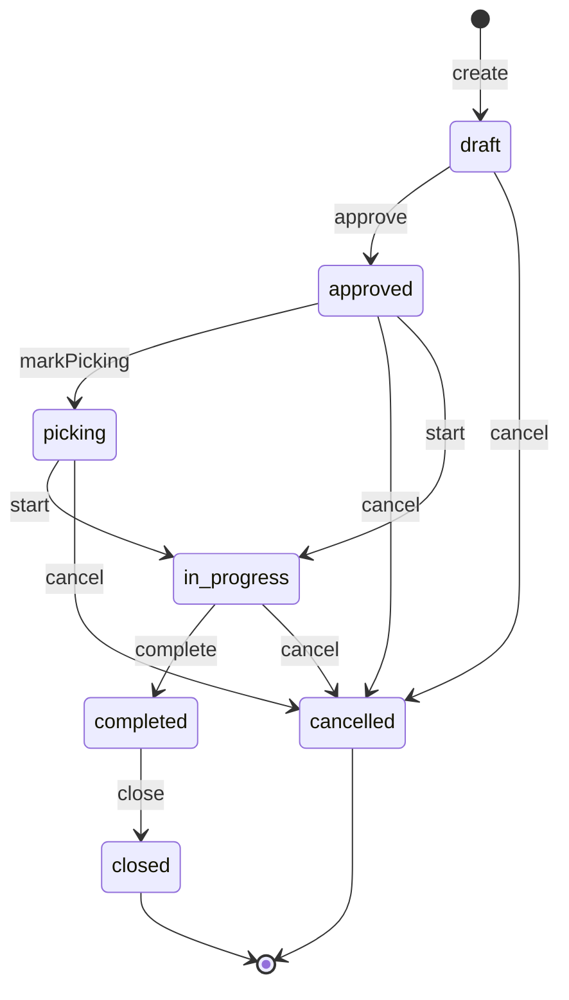

# 生产模块文档

## 1. 概述

生产模块（production 域）负责生产执行的全流程管理，包含四个核心聚合根：

- **生产工单（WorkOrder）**：生产任务的主体，7 态状态机贯穿草稿到结案全生命周期
- **领料单（PickOrder）**：从仓库领取生产所需物料，审核后扣减库存
- **报工单（WorkReport）**：记录工序产出（合格/不良），审核后联动工装使用次数
- **完工入库单（FinishOrder）**：成品入库，审核后增加库存、回写工单完工数量

四个聚合根以 WorkOrder 为中心协同：PickOrder/WorkReport/FinishOrder 均关联 workOrderId，通过领域事件驱动库存与成本联动。

> **依据**：`docs/生产工单 - 领料 - 库存 - 完工入库 全链路完善方案.md`、`docs/03-技术规范/业务规则-生产.md`、`docs/plans/2026-07-10-production-module-upgrade.md`

## 2. 架构分层

```
src/app/api/workorders/route.ts                              表现层（withPermission）
src/app/api/warehouse/production-inbound/route.ts
src/app/api/material-returns/route.ts
        ↓
src/application/handlers/WorkOrderMaterialIssuedHandler.ts   应用层（事件处理器）
src/application/handlers/WorkOrderCompletedHandler.ts
src/application/handlers/PickOrderInventoryHandler.ts
src/application/handlers/FinishOrderInventoryHandler.ts
src/application/handlers/MaterialReturnInventoryHandler.ts
        ↓
src/domain/production/aggregates/WorkOrder.ts                领域层（聚合根）
src/domain/production/aggregates/PickOrder.ts
src/domain/production/aggregates/WorkReport.ts
src/domain/production/aggregates/FinishOrder.ts
src/domain/production/entities/MaterialRequirement.ts        领域实体
src/domain/production/entities/ProductionSchedule.ts
src/domain/production/value-objects/WorkOrderStatus.ts       值对象（状态机）
src/domain/production/value-objects/WorkOrderStateMachine.ts
src/domain/production/events/WorkOrderEvents.ts              领域事件
src/domain/production/events/PickOrderEvents.ts
src/domain/production/events/WorkReportEvents.ts
src/domain/production/events/FinishOrderEvents.ts
src/domain/production/events/ReturnOrderEvents.ts
src/domain/production/repositories/IWorkOrderRepository.ts   仓储接口
        ↓
src/infrastructure/event-bus/EventBus.ts                     基础设施层（事件总线 + Outbox）
src/infrastructure/event-bus/DomainEventOutboxFactory.ts
```

## 3. 领域模型

### 3.1 聚合根：WorkOrder（生产工单）

文件：`src/domain/production/aggregates/WorkOrder.ts`

生产工单是生产模块的核心聚合根，承载 7 态状态机与物料需求（BOM）。

| 属性 | 类型 | 说明 |
|---|---|---|
| `id` | number | 主键 |
| `workOrderNo` | string | 工单编号 |
| `status` | WorkOrderStatusVO | 状态值对象（7 态） |
| `productId` / `productName` / `productCode` | number / string | 产品信息 |
| `plannedQty` | number | 计划数量 |
| `completedQty` | number | 已完工数量 |
| `orderType` | number | 订单类型（0 普通工单 / 1 打样工单） |
| `processId` / `processName` | number / string | 工序 |
| `warehouseId` | number | 入库仓库（默认 1） |
| `plannedStartDate` / `plannedEndDate` | string | 计划起止日期 |
| `actualStartDate` / `actualEndDate` | string | 实际起止日期 |
| `materialRequirements` | MaterialRequirement[] | 物料需求列表 |
| `createBy` | number | 创建人 |
| `remark` | string | 备注 |

**核心方法**：

| 方法 | 职责 | 触发事件 |
|---|---|---|
| `approve(userId)` | 审核（草稿 → 已审核） | `WorkOrderApprovedEvent` |
| `start()` | 开工（已审核/领料中 → 生产中），记录实际开始时间 | `WorkOrderStartedEvent` |
| `markPicking()` | 标记领料中（已审核 → 领料中） | `WorkOrderPickingEvent` |
| `issueMaterials(issues)` | 领料（已审核/领料中/生产中可操作），扣减 BOM 已发数量 | `WorkOrderMaterialIssuedEvent` |
| `complete(completedQty, warehouseId)` | 完工（生产中 → 已完工），累计完工数量并校验不超计划 | `WorkOrderCompletedEvent` |
| `close()` | 结案（已完工 → 已结案） | `WorkOrderClosedEvent` |
| `cancel(reason, userId)` | 作废（非结案/作废/完工状态可作废） | `WorkOrderCancelledEvent` |

**工厂方法**：`create(props)`（新建，触发 `WorkOrderCreatedEvent`）、`reconstitute(props)`（从数据库重建）。

**物料需求（MaterialRequirement）**：实体，承载 `materialId`、`materialCode`、`materialName`、`requiredQty`、`issuedQty`，支持 `issue(quantity)` 累计发料。

### 3.2 聚合根：PickOrder（领料单）

文件：`src/domain/production/aggregates/PickOrder.ts`

领料单关联工单，3 态状态机，审核后扣减库存。

| 属性 | 说明 |
|---|---|
| `id` / `pickNo` | 主键、领料单号 |
| `workOrderId` | 关联工单 ID（必填） |
| `warehouseId` | 出库仓库（默认 1） |
| `pickerName` | 领料人 |
| `totalQty` | 总数量（明细汇总） |
| `status` | PickOrderStatus：draft / approved / cancelled |
| `items` | 领料明细（PickOrderItem[]） |

**PickOrderItem**：`materialId`、`materialName`、`materialSpec`、`requiredQty`、`actualQty`、`batchNo`、`unitCost`、`lineAmount`、`unit`。

**核心方法**：

| 方法 | 职责 | 触发事件 |
|---|---|---|
| `approve(userId)` | 审核（草稿 → 已审核），携带明细触发库存扣减 | `PickOrderApprovedEvent` |
| `cancel(reason, userId)` | 作废（草稿/已审核 → 已作废） | `PickOrderCancelledEvent` |

### 3.3 聚合根：WorkReport（报工单）

文件：`src/domain/production/aggregates/WorkReport.ts`

报工单记录工序产出，3 态状态机，审核后联动工装使用次数与成本归集。

| 属性 | 说明 |
|---|---|
| `id` / `reportNo` | 主键、报工单号 |
| `workOrderId` | 关联工单 ID（必填） |
| `processName` | 工序名称（必填） |
| `equipmentId` / `equipmentName` | 设备 |
| `shift` | 班次 |
| `operatorName` | 操作员 |
| `qualifiedQty` | 合格数量 |
| `defectiveQty` | 不良数量 |
| `defectReason` | 不良原因 |
| `workHours` | 工时 |
| `reportDate` | 报工日期 |
| `status` | WorkReportStatus：draft / approved / cancelled |

**核心方法**：

| 方法 | 职责 | 触发事件 |
|---|---|---|
| `approve(userId)` | 审核（草稿 → 已审核），携带 toolIds 与工序信息 | `WorkReportApprovedEvent` |
| `cancel(reason, userId)` | 作废（草稿/已审核 → 已作废） | `WorkReportCancelledEvent` |

**校验规则**：合格数或不良数至少有一个大于 0。

### 3.4 聚合根：FinishOrder（完工入库单）

文件：`src/domain/production/aggregates/FinishOrder.ts`

完工入库单承载成品入库信息，3 态状态机，审核后增加成品库存。

| 属性 | 说明 |
|---|---|
| `id` / `finishNo` | 主键、完工单号 |
| `workOrderId` | 关联工单 ID（必填） |
| `warehouseId` | 入库仓库（必填） |
| `qualifiedQty` | 合格数量（必填，>0） |
| `defectiveQty` | 不良数量 |
| `status` | FinishOrderStatus：draft / approved / cancelled |

**核心方法**：

| 方法 | 职责 | 触发事件 |
|---|---|---|
| `approve(userId, workOrderNo, productName)` | 审核（草稿 → 已审核），携带完整入库信息 | `FinishOrderApprovedEvent` |
| `cancel(reason, userId)` | 作废（草稿/已审核 → 已作废） | `FinishOrderCancelledEvent` |

## 4. 值对象与状态机

### 4.1 WorkOrderStatus（工单状态 - 7 态）

文件：`src/domain/production/value-objects/WorkOrderStatus.ts`

| 状态值 | DB Code | 标签 |
|---|---|---|
| `draft` | 1 | 草稿 |
| `approved` | 2 | 已审核 |
| `picking` | 3 | 领料中 |
| `in_progress` | 4 | 生产中 |
| `completed` | 5 | 已完工 |
| `closed` | 6 | 已结案 |
| `cancelled` | 7 | 已作废 |

**状态流转**：



| 当前状态 | 允许流转到 |
|---|---|
| `draft` | `approved`, `cancelled` |
| `approved` | `picking`, `cancelled` |
| `picking` | `in_progress`, `cancelled` |
| `in_progress` | `completed`, `cancelled` |
| `completed` | `closed` |
| `closed` | （终态） |
| `cancelled` | （终态） |

**操作权限**：
- `canEdit` / `canDelete` / `canApprove`：仅草稿
- `canPick`：仅已审核
- `canStart`：已审核或领料中
- `canComplete`：仅生产中
- `canClose`：仅已完工
- `canCancel`：非结案/作废/完工状态

**WorkOrderStatusVO 方法**：`canTransitionTo(target)`、`transitionTo(target)`（非法流转抛 `DomainError`）、`fromDbCode(code)`、`toDbCode()`、`label()`、`equals(other)`。

### 4.2 其他聚合根状态机

| 聚合根 | 状态 | 流转 |
|---|---|---|
| PickOrder | draft → approved / cancelled | 仅 draft 可 approve；draft/approved 可 cancel |
| WorkReport | draft → approved / cancelled | 仅 draft 可 approve；draft/approved 可 cancel |
| FinishOrder | draft → approved / cancelled | 仅 draft 可 approve；draft/approved 可 cancel |

## 5. 领域事件

### 5.1 工单事件

文件：`src/domain/production/events/WorkOrderEvents.ts`

| 事件类 | eventType | 触发时机 |
|---|---|---|
| `WorkOrderCreatedEvent` | `workorder.created` | 创建工单 |
| `WorkOrderApprovedEvent` | `workorder.approved` | 审核通过 |
| `WorkOrderStartedEvent` | `workorder.started` | 开工 |
| `WorkOrderPickingEvent` | `workorder.picking` | 标记领料中 |
| `WorkOrderMaterialIssuedEvent` | `workorder.material_issued` | 领料（携带 issuedItems 明细） |
| `WorkOrderCompletedEvent` | `workorder.completed` | 完工（携带 completedQty、warehouseId） |
| `WorkOrderClosedEvent` | `workorder.closed` | 结案 |
| `WorkOrderCancelledEvent` | `workorder.cancelled` | 作废 |
| `WorkReportedEvent` | `workorder.reported` | 报工（携带 toolIds 用于工装使用联动） |

### 5.2 领料单事件

文件：`src/domain/production/events/PickOrderEvents.ts`

| 事件类 | eventType | 触发时机 |
|---|---|---|
| `PickOrderCreatedEvent` | `prod.pick.created` | 创建领料单 |
| `PickOrderApprovedEvent` | `prod.pick.approved` | 领料审核（携带 items 触发库存扣减） |
| `PickOrderCancelledEvent` | `prod.pick.cancelled` | 作废 |
| `MaterialReturnApprovedEvent` | `prod.return.approved` | 退料审核（携带 items 触发库存增加） |

### 5.3 报工单事件

文件：`src/domain/production/events/WorkReportEvents.ts`

| 事件类 | eventType | 触发时机 |
|---|---|---|
| `WorkReportCreatedEvent` | `prod.report.created` | 创建报工单 |
| `WorkReportApprovedEvent` | `prod.report.approved` | 报工审核（携带 toolIds 联动工装使用） |
| `WorkReportCancelledEvent` | `prod.report.cancelled` | 作废 |

### 5.4 完工入库单事件

文件：`src/domain/production/events/FinishOrderEvents.ts`

| 事件类 | eventType | 触发时机 |
|---|---|---|
| `FinishOrderCreatedEvent` | `prod.finish.created` | 创建完工单 |
| `FinishOrderApprovedEvent` | `prod.finish.approved` | 完工审核（触发库存增加） |
| `FinishOrderCancelledEvent` | `prod.finish.cancelled` | 作废 |

### 5.5 退料事件

文件：`src/domain/production/events/ReturnOrderEvents.ts`

包含生产退料相关事件，与 `MaterialReturnApprovedEvent` 协同处理退料入库。

### 5.6 事件处理器注册

文件：`src/application/EventRegistry.ts`

| eventType | 处理器 |
|---|---|
| `workorder.created` | `AuditLogHandler`、`CacheInvalidationHandler` |
| `workorder.reported` | `ToolUsageSyncHandler`（幂等） |
| `workorder.material_issued` | `WorkOrderMaterialIssuedHandler`（幂等）、`AuditLogHandler` |
| `workorder.completed` | `WorkOrderCompletedHandler`、`FinanceVoucherHandler`、`QrCodeGenerationHandler`、`InkCostHandler`、`ScreenPlateCostHandler`、`ToolCostHandler`、`AuditLogHandler`、`CacheInvalidationHandler` |
| `workorder.closed` | `ProductionFinanceHandler`（幂等）、`AuditLogHandler` |
| `prod.pick.approved` | `PickOrderInventoryHandler`（幂等）、`AuditLogHandler`、`CacheInvalidationHandler` |
| `prod.return.approved` | `MaterialReturnInventoryHandler`（幂等）、`AuditLogHandler`、`CacheInvalidationHandler` |
| `prod.report.approved` | `WorkOrderMaterialIssuedHandler`（幂等）、`AuditLogHandler` |
| `prod.finish.approved` | `FinishOrderInventoryHandler`（幂等）、`AuditLogHandler`、`CacheInvalidationHandler` |

## 6. 事件链路：FinishOrderApprovedEvent 完整链路

完工入库审核后的事件链路是生产模块最关键的库存联动场景，完整路径如下：

```
┌─────────────────────────────────────────────────────────────────────┐
│ 1. Route 层（HTTP 入口）                                              │
│    src/app/api/warehouse/production-inbound/route.ts                 │
│    PUT /api/warehouse/production-inbound  body: { id, action: 'post' }│
└──────────────────────────┬──────────────────────────────────────────┘
                           │
                           ▼
┌─────────────────────────────────────────────────────────────────────┐
│ 2. Route 事务内操作（transaction）                                    │
│    a. SELECT 入库单 FOR UPDATE（校验 status < 3、qc_status ≠ fail）   │
│    b. 遍历明细：UPDATE/INSERT inv_inventory（增加成品库存）           │
│    c. INSERT inv_inventory_transaction（库存流水，source_type=        │
│       'production_inbound'）                                          │
│    d. UPDATE inv_production_inbound SET status = 3                    │
│    e. UPDATE prod_work_order SET completed_qty += totalQty            │
│    f. 工单状态联动：completed_qty >= plan_qty → status=50            │
│                       completed_qty > 0      → status=40            │
│    g. ★ 写入 Outbox：getDomainEventOutbox().saveEvents(conn,          │
│       'ProductionInbound', id, [new FinishOrderApprovedEvent(...)])   │
└──────────────────────────┬──────────────────────────────────────────┘
                           │ 事务提交
                           ▼
┌─────────────────────────────────────────────────────────────────────┐
│ 3. Route 事务后操作                                                   │
│    a. 生成成品二维码 qrcode_record（每个明细一条，qr_type='product'）  │
│    b. logOperation 记录操作日志                                       │
└──────────────────────────┬──────────────────────────────────────────┘
                           │ Outbox Poller 投递
                           ▼
┌─────────────────────────────────────────────────────────────────────┐
│ 4. Event Bus 分发（EventRegistry 注册）                               │
│    eventType: 'prod.finish.approved'                                  │
│    订阅者：                                                           │
│    - IdempotentHandler(FinishOrderInventoryHandler)                  │
│    - AuditLogHandler                                                  │
│    - CacheInvalidationHandler                                         │
└──────────────────────────┬──────────────────────────────────────────┘
                           │
                           ▼
┌─────────────────────────────────────────────────────────────────────┐
│ 5. FinishOrderInventoryHandler.handle(event)                          │
│    文件：src/application/handlers/FinishOrderInventoryHandler.ts      │
│    功能：增加成品库存 + 回写工单完工数量（幂等）                       │
│                                                                       │
│    幂等机制：INSERT IGNORE INTO inv_inventory_transaction，           │
│    唯一索引 uk_inv_txn_source (source_type, source_id) 防重复         │
│    - source_type = 'prod_finish'                                      │
│    - source_id = finishOrderId                                        │
│    - affectedRows === 0 → 已处理，跳过                                │
│    - affectedRows === 1 → 首次处理，继续                              │
│                                                                       │
│    事务内操作：                                                       │
│    a. SELECT prod_work_order 获取产品信息                             │
│    b. INSERT IGNORE inv_inventory_transaction（幂等屏障）             │
│    c. SELECT inv_inventory 判断库存是否存在                           │
│    d. 存在：UPDATE inv_inventory SET quantity += qualifiedQty         │
│    e. 不存在：INSERT inv_inventory                                    │
└─────────────────────────────────────────────────────────────────────┘
```

**关键设计要点**：

1. **Transactional Outbox**：Route 层在事务内写入 `domain_event_outbox` 表，保证聚合状态变更与事件发布原子性
2. **幂等处理**：`FinishOrderInventoryHandler` 通过 `INSERT IGNORE` + 唯一索引 `uk_inv_txn_source` 防止 XAUTOCLAIM 重投递导致的重复库存增加（TOCTOU 竞态）
3. **事务边界**：Handler 内部使用独立事务包裹 INSERT IGNORE + 库存 UPDATE，保证三步原子性
4. **双写说明**：当前 Route 层在事务内已直接更新 `inv_inventory`，Handler 作为事件驱动补充（二维码生成、审计等），两者通过幂等机制保证最终一致

> **相关文档**：`docs/07-决策记录/005-完工入库幂等策略.md` 详细记录幂等设计决策。

## 7. API 接口

### 7.1 工单 API

| 方法 | 路径 | 功能 |
|---|---|---|
| GET | `/api/workorders` | 工单列表查询（支持状态/产品/日期筛选） |
| POST | `/api/workorders` | 创建工单 |
| PUT | `/api/workorders` | 更新工单 / 状态流转 |
| DELETE | `/api/workorders` | 删除工单（仅草稿） |

### 7.2 生产入库 API

文件：`src/app/api/warehouse/production-inbound/route.ts`

| 方法 | 路径 | 功能 |
|---|---|---|
| GET | `/api/warehouse/production-inbound` | 入库单列表（支持 inboundNo/status/workOrderNo 筛选） |
| POST | `/api/warehouse/production-inbound` | 创建入库单（校验工单状态 ≥ 20 且 < 90） |
| PUT | `/api/warehouse/production-inbound` | `action=post` 过账入库 / `action=qc` 质检 / 更新状态 |
| DELETE | `/api/warehouse/production-inbound` | 删除入库单（仅 status < 3） |

**过账（action=post）流程**：
1. 校验入库单状态与质检结果
2. 遍历明细：增加 `inv_inventory` 库存 + 写 `inv_inventory_transaction` 流水
3. 更新入库单 `status = 3`
4. 回写工单 `completed_qty` 并联动工单状态（40 生产中 / 50 已完工）
5. 写入 `FinishOrderApprovedEvent` 到 Outbox
6. 事务后生成成品二维码 `qrcode_record`

### 7.3 退料 API

| 方法 | 路径 | 功能 |
|---|---|---|
| GET | `/api/material-returns` | 退料单列表 |
| POST | `/api/material-returns` | 创建退料单 |
| PUT | `/api/material-returns` | 审核退料单（触发 `MaterialReturnApprovedEvent`） |

### 7.4 领料/报工 API

领料单与报工单的 API 通过工单聚合根的 `issueMaterials`、报工审核等用例间接暴露，主要经由 `/api/workorders` 与生产管理页面调用。

### 7.5 关联 API

| 路径 | 功能 |
|---|---|
| `/api/dashboard/production` | 生产看板 |
| `/api/advanced/scheduling/optimize` | 排产优化 |
| `/api/material-requisitions` | 物料领用 |
| `/api/material-requisitions/[id]/issue` | 物料领用发料 |

## 8. 业务流程

### 8.1 工单全生命周期

```
创建工单（draft）
   ↓ approve
已审核（approved）
   ↓ markPicking / issueMaterials
领料中（picking）—— 领料审核触发 PickOrderApprovedEvent → 库存扣减
   ↓ start
生产中（in_progress）—— 报工审核触发 WorkReportApprovedEvent → 工装使用累计
   ↓ complete(completedQty, warehouseId)
已完工（completed）—— 触发 WorkOrderCompletedEvent → 成本归集/二维码生成
   ↓ close
已结案（closed）—— 触发 WorkOrderClosedEvent → 财务凭证
```

### 8.2 完工入库流程

```
创建入库单（status=1）
   ↓ 质检（action=qc，qc_status=pass/fail）
   ↓ 过账（action=post）
入库完成（status=3）
   ├─→ 增加成品库存 inv_inventory
   ├─→ 写库存流水 inv_inventory_transaction
   ├─→ 回写工单 completed_qty + 状态联动
   ├─→ 写 Outbox: FinishOrderApprovedEvent
   └─→ 生成成品二维码 qrcode_record
   ↓ Outbox Poller 投递
FinishOrderInventoryHandler（幂等兜底）
```

## 9. 关键文件清单

| 文件 | 说明 |
|---|---|
| `src/domain/production/aggregates/WorkOrder.ts` | 生产工单聚合根（7 态状态机） |
| `src/domain/production/aggregates/PickOrder.ts` | 领料单聚合根（3 态） |
| `src/domain/production/aggregates/WorkReport.ts` | 报工单聚合根（3 态） |
| `src/domain/production/aggregates/FinishOrder.ts` | 完工入库单聚合根（3 态） |
| `src/domain/production/entities/MaterialRequirement.ts` | 物料需求实体 |
| `src/domain/production/entities/ProductionSchedule.ts` | 排产计划实体 |
| `src/domain/production/value-objects/WorkOrderStatus.ts` | 工单状态机值对象 |
| `src/domain/production/value-objects/WorkOrderStateMachine.ts` | 工单状态机辅助 |
| `src/domain/production/events/WorkOrderEvents.ts` | 工单事件（9 个） |
| `src/domain/production/events/PickOrderEvents.ts` | 领料单事件（4 个） |
| `src/domain/production/events/WorkReportEvents.ts` | 报工单事件（3 个） |
| `src/domain/production/events/FinishOrderEvents.ts` | 完工单事件（3 个） |
| `src/domain/production/events/ReturnOrderEvents.ts` | 退料事件 |
| `src/domain/production/repositories/IWorkOrderRepository.ts` | 工单仓储接口 |
| `src/domain/production/repositories/IPickOrderRepository.ts` | 领料单仓储接口 |
| `src/domain/production/repositories/IWorkReportRepository.ts` | 报工单仓储接口 |
| `src/domain/production/repositories/IFinishOrderRepository.ts` | 完工单仓储接口 |
| `src/domain/production/repositories/IScheduleRepository.ts` | 排产仓储接口 |
| `src/application/handlers/FinishOrderInventoryHandler.ts` | 完工入库库存联动处理器 |
| `src/application/handlers/PickOrderInventoryHandler.ts` | 领料库存扣减处理器 |
| `src/application/handlers/WorkOrderCompletedHandler.ts` | 工单完工处理器 |
| `src/application/handlers/WorkOrderMaterialIssuedHandler.ts` | 领料发料处理器 |
| `src/application/handlers/MaterialReturnInventoryHandler.ts` | 退料入库处理器 |
| `src/application/handlers/ToolUsageSyncHandler.ts` | 工装使用同步处理器 |
| `src/application/handlers/ToolCostHandler.ts` | 工装成本归集处理器 |
| `src/application/handlers/InkCostHandler.ts` | 油墨成本归集处理器 |
| `src/application/handlers/ScreenPlateCostHandler.ts` | 网版成本归集处理器 |
| `src/application/handlers/ProductionFinanceHandler.ts` | 生产财务凭证处理器 |
| `src/app/api/warehouse/production-inbound/route.ts` | 生产入库 API 路由 |
| `src/app/api/workorders/route.ts` | 工单 API 路由 |
| `src/app/api/material-returns/route.ts` | 退料 API 路由 |

> 最后更新：2026-07-15
