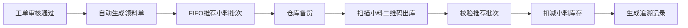
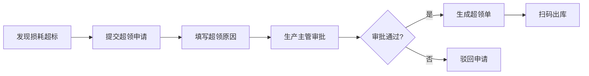
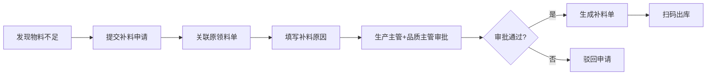
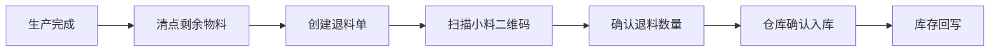

# 物料领用管理模块 详细设计

> 文档编号：VNERP-DESIGN-021  
> 版本：V1.0  
> 更新日期：2026-05-10

---

## 1. 模块概述

### 1.1 设计目标

物料领用管理模块是连接生产与仓库的核心环节，负责管理生产所需原材料的领用流程。本模块针对丝网印刷行业特点，特别强化小料领用管理，确保先进先出原则的执行和精准的批次追溯。

### 1.2 核心能力

- **自动领料单生成**：工单下发后自动按BOM生成领料单
- **小料领用**：支持整料拆分后的小料精准领用
- **FIFO推荐**：系统自动推荐最早入库的小料批次
- **扫码领料**：通过扫描小料二维码完成出库
- **审批流程**：超领、补料需要审批

---

## 2. 领料类型与流程

### 2.1 领料类型定义

| 类型 | 说明 | 触发条件 |
|------|------|----------|
| 正常领料 | 按BOM标准用量领料 | 工单下发后自动生成 |
| 超领 | 超过BOM标准用量的领料 | 生产损耗超标时申请 |
| 补料 | 补充之前领料不足的物料 | 发现物料不足时申请 |
| 退料 | 将未使用物料退回仓库 | 生产完成后剩余物料 |

### 2.2 正常领料流程



**详细流程：**

1. **工单审核通过并下发后**，系统根据 BOM 自动生成领料单
2. **系统自动计算所需小料数量**，并根据先进先出原则推荐小料批次
3. **仓库人员根据推荐批次准备小料**
4. **扫描小料二维码进行出库**
5. **系统自动校验是否为推荐批次**，非推荐批次需要提交异常申请
6. **确认出库后，系统自动扣减小料库存**
7. **生成追溯记录，建立工单与小料二维码的关联关系**

### 2.3 超领流程



**详细流程：**

1. **生产人员发现实际损耗超过标准损耗**，提交超领申请
2. **填写超领原因**（必填）
3. **提交生产主管审批**
4. **审批通过后生成超领领料单**
5. **仓库人员按超领单扫码出库**

### 2.4 补料流程



**详细流程：**

1. **生产人员发现物料不足**，提交补料申请
2. **系统自动关联原领料单**（通过 original_requisition_id）
3. **填写补料原因**（必填）
4. **提交生产主管和品质主管双重审批**
5. **审批通过后生成补料领料单**
6. **仓库人员按补料单扫码出库**

### 2.5 退料流程



**详细流程：**

1. **生产完成后**，生产人员清点剩余物料
2. **创建退料单**，填写退料物料和数量
3. **扫描小料二维码**（如果是整卷未拆封，扫描整料二维码）
4. **确认退料数量**
5. **仓库人员确认入库**
6. **系统自动回写库存**，增加仓库库存数量

---

## 3. 数据结构设计

### 3.1 领料单主表（material_requisitions）

| 字段名 | 类型 | 说明 |
|--------|------|------|
| id | bigint | 主键 |
| requisition_no | varchar(20) | 领料单编号，格式：MR+YYYYMMDD+4位序号 |
| work_order_id | bigint | 关联工单 ID |
| type | varchar(10) | 类型：正常领料、超领、补料 |
| status | smallint | 状态：0=待审批，1=待出库，2=已出库，3=已取消 |
| applicant_id | bigint | 申请人 ID |
| approver_id | bigint | 审批人 ID |
| total_quantity | decimal(10,2) | 领料总数量 |
| create_time | datetime | 创建时间 |
| update_time | datetime | 更新时间 |
| remark | text | 备注 |
| original_requisition_id | bigint | 原领料单 ID（补料时关联） |

### 3.2 领料单明细表（material_requisition_items）

| 字段名 | 类型 | 说明 |
|--------|------|------|
| id | bigint | 主键 |
| requisition_id | bigint | 领料单 ID |
| material_id | bigint | 物料 ID |
| planned_quantity | decimal(10,2) | 计划数量（BOM计算） |
| actual_quantity | decimal(10,2) | 实际领用数量 |
| issued_quantity | decimal(10,2) | 已出库数量 |
| unit | varchar(10) | 单位 |
| qr_code | varchar(20) | 小料二维码 |
| batch_no | varchar(50) | 批次号 |
| warehouse_location | varchar(50) | 库位 |
| fifo_recommended | boolean | 是否为FIFO推荐批次 |

### 3.3 退料单主表（material_returns）

| 字段名 | 类型 | 说明 |
|--------|------|------|
| id | bigint | 主键 |
| return_no | varchar(20) | 退料单编号，格式：RT+YYYYMMDD+4位序号 |
| work_order_id | bigint | 关联工单 ID |
| requisition_id | bigint | 关联领料单 ID |
| status | smallint | 状态：0=待确认，1=已入库，2=已取消 |
| applicant_id | bigint | 申请人 ID |
| total_quantity | decimal(10,2) | 退料总数量 |
| create_time | datetime | 创建时间 |
| confirm_time | datetime | 确认时间 |
| remark | text | 备注 |

---

## 4. 核心接口设计

### 4.1 自动生成领料单

```http
POST /api/material-requisitions/auto-generate
Content-Type: application/json
Authorization: Bearer {token}

{
  "work_order_id": 1
}

Response:
{
  "code": 200,
  "message": "success",
  "data": {
    "requisition_no": "MR202605100001",
    "type": "正常领料",
    "status": "待出库",
    "items": [
      {
        "material_id": 1,
        "material_name": "PET薄膜",
        "planned_quantity": 100,
        "recommended_batches": [
          {
            "qr_code": "VNR2026050900000011",
            "batch_no": "RM20260509001",
            "quantity": 10
          }
        ]
      }
    ]
  }
}
```

### 4.2 提交超领申请

```http
POST /api/material-requisitions/over-issue
Content-Type: application/json
Authorization: Bearer {token}

{
  "work_order_id": 1,
  "material_id": 1,
  "quantity": 20,
  "reason": "印刷过程中发现薄膜有瑕疵，损耗超标"
}
```

### 4.3 提交补料申请

```http
POST /api/material-requisitions/supplementary
Content-Type: application/json
Authorization: Bearer {token}

{
  "original_requisition_id": 1,
  "material_id": 1,
  "quantity": 10,
  "reason": "之前领用的薄膜数量不足，需要补充"
}
```

### 4.4 扫码领料出库

```http
POST /api/material-requisitions/{id}/issue
Content-Type: application/json
Authorization: Bearer {token}

{
  "items": [
    {
      "material_id": 1,
      "qr_code": "VNR2026050900000011",
      "quantity": 10
    }
  ]
}

Response:
{
  "code": 200,
  "message": "success",
  "data": {
    "requisition_no": "MR202605100001",
    "status": "已出库",
    "issued_items": [
      {
        "material_name": "PET薄膜",
        "qr_code": "VNR2026050900000011",
        "quantity": 10,
        "fifo_recommended": true
      }
    ]
  }
}
```

### 4.5 创建退料单

```http
POST /api/material-returns
Content-Type: application/json
Authorization: Bearer {token}

{
  "work_order_id": 1,
  "requisition_id": 1,
  "items": [
    {
      "material_id": 1,
      "qr_code": "VNR2026050900000011",
      "quantity": 2,
      "reason": "生产完成剩余"
    }
  ]
}
```

---

## 5. 与其他模块的集成

| 模块 | 集成点 |
|------|--------|
| 生产管理 | 工单下发自动生成领料单 |
| 仓库管理 | 领料出库扣减库存，退料入库增加库存 |
| 二维码追溯 | 扫码领料建立工单与小料的关联 |
| 品质管理 | 补料需要品质主管审批 |
| 财务管理 | 领料数据用于工单成本核算 |

---

## 6. 异常处理

| 异常场景 | 处理方式 |
|----------|----------|
| 小料不足 | 系统自动提示并生成整料拆分任务 |
| 整料未拆分 | 系统禁止领用整料，提示先进行拆分 |
| 非FIFO批次 | 系统提示并禁止出库，需提交异常申请 |
| 超领未审批 | 系统禁止生成领料单，需先完成审批 |
| 补料超量 | 系统校验补料数量不能超过原领料单数量 |
| 退料数量异常 | 系统校验退料数量不能超过已领用数量 |

---

## 7. 报表统计

- **领料明细报表**：按工单、物料、时间统计领料情况
- **超领分析报表**：统计超领次数、原因和金额
- **补料分析报表**：统计补料次数、原因和金额
- **退料统计报表**：统计退料数量和金额
- **物料消耗分析报表**：分析各物料的消耗趋势
