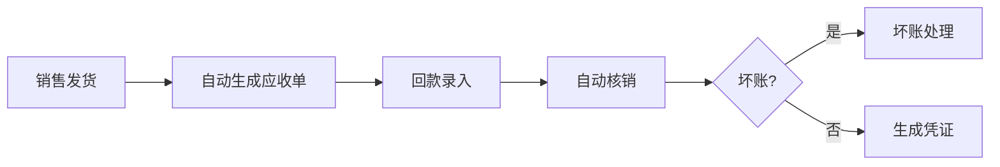
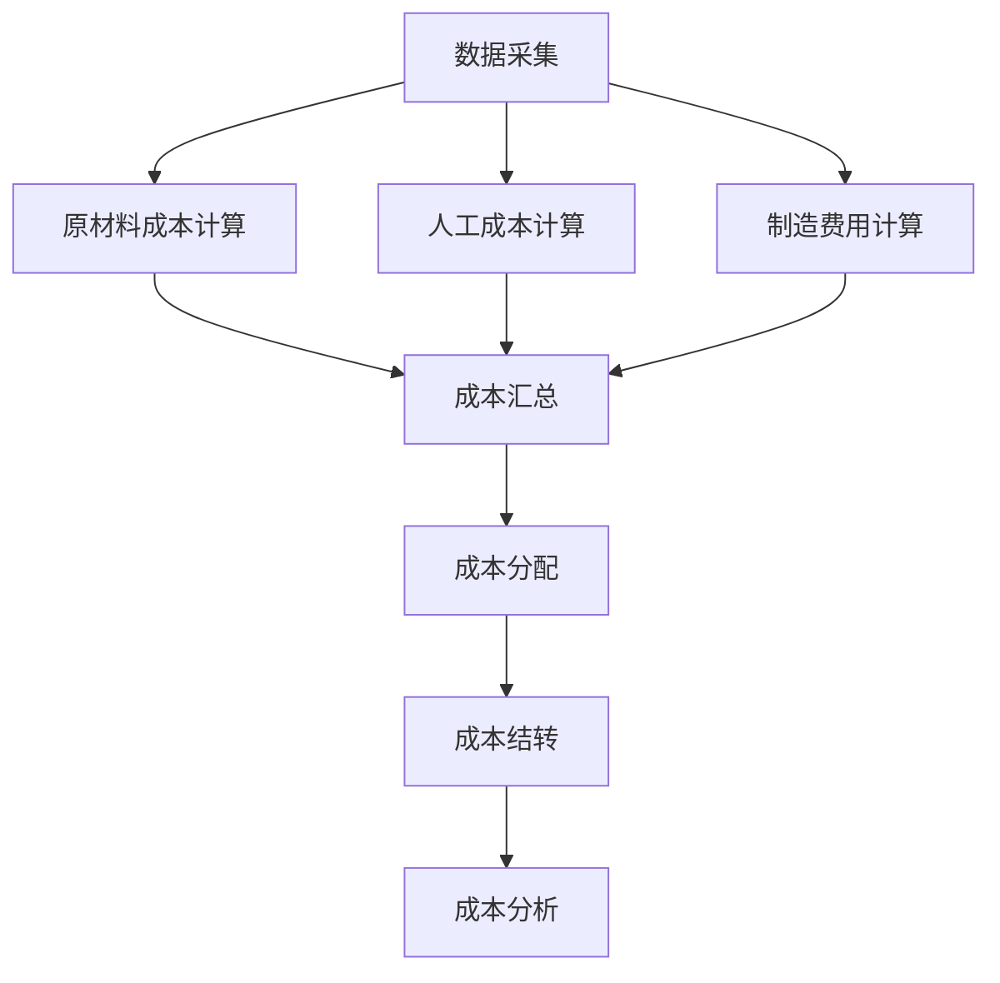

# 财务管理模块 详细设计

> 文档编号：VNERP-DESIGN-024  
> 版本：V1.0  
> 更新日期：2026-05-10

---

## 1. 模块概述

### 1.1 设计目标

本模块是丝网印刷 ERP 系统的财务闭环核心，与销售、采购、生产、仓库、品质管理模块深度集成，实现业务驱动财务、自动核算、实时数据、精准成本的全流程财务管理。针对丝网印刷行业特点，重点强化工单级精准成本核算和小料批次成本追溯，解决行业普遍存在的成本核算模糊、财务数据滞后、业务财务脱节等痛点。

### 1.2 核心能力

- **业务驱动财务**：所有财务数据 100% 来自业务单据
- **成本精准核算**：精确到单个工单、单个物料批次、单个小料单元
- **实时财务数据**：业务单据审核后自动生成财务数据
- **全流程追溯**：所有财务数据都可追溯到对应的业务单据

---

## 2. 核心设计原则

| 原则 | 说明 | 系统保障 |
|------|------|----------|
| 业务驱动财务 | 所有财务数据 100% 来自业务单据 | 禁止手工录入财务凭证 |
| 成本精准核算 | 精确到工单、批次、小料 | 二维码关联成本 |
| 实时财务数据 | 业务单据审核后自动生成 | 事件驱动 |
| 合规性 | 遵循企业会计准则 | 标准财务报表 |
| 全流程追溯 | 财务数据可追溯到业务单据 | 关联记录 |

---

## 3. 核心模块组成

```
财务管理
├── 应收管理
├── 应付管理
├── 成本核算（核心）
└── 财务报表
```

---

## 4. 应收管理

### 4.1 模块功能

负责销售业务产生的应收账款管理，从销售发货自动生成应收单，到回款录入、自动核销、坏账处理的全流程管理。

### 4.2 核心流程



**详细流程：**

1. **自动生成应收单**：销售发货单审核通过后，系统自动生成应收单
   - 应收单包含：客户名称、销售订单号、发货单号、应收金额、应收日期
   - 自动关联销售订单和发货单明细

2. **回款录入**：财务人员收到客户回款后，在系统中录入回款信息

3. **自动核销**：系统自动将回款与对应的应收单进行核销
   - 支持按单核销、按金额核销、批量核销
   - 核销后自动更新应收单状态和客户余额

4. **坏账处理**：对于无法收回的应收账款，提交坏账申请，经审批后做坏账处理

5. **生成凭证**：所有应收和回款操作自动生成财务凭证

### 4.3 数据结构设计

#### 4.3.1 应收单主表（fin_receivable）

| 字段名 | 类型 | 说明 |
|--------|------|------|
| id | bigint | 主键 |
| receivable_no | varchar(20) | 应收单编号，格式：AR+YYYYMMDD+4位序号 |
| sales_order_id | bigint | 关联销售订单 ID |
| shipment_id | bigint | 关联发货单 ID |
| customer_id | bigint | 客户 ID |
| total_amount | decimal(12,2) | 应收总金额 |
| received_amount | decimal(12,2) | 已收金额 |
| unpaid_amount | decimal(12,2) | 未收金额 |
| due_date | date | 到期日期 |
| status | varchar(20) | 状态：未收款、部分收款、已收款、已坏账 |
| create_time | datetime | 创建时间 |
| update_time | datetime | 更新时间 |
| remark | text | 备注 |

#### 4.3.2 回款记录表（fin_receipts）

| 字段名 | 类型 | 说明 |
|--------|------|------|
| id | bigint | 主键 |
| receipt_no | varchar(20) | 回款单编号，格式：RC+YYYYMMDD+4位序号 |
| customer_id | bigint | 客户 ID |
| amount | decimal(12,2) | 回款金额 |
| payment_method | varchar(20) | 付款方式：现金、银行转账、微信、支付宝 |
| receipt_date | date | 回款日期 |
| operator_id | bigint | 操作人员 ID |
| create_time | datetime | 创建时间 |
| remark | text | 备注 |

---

## 5. 应付管理

### 5.1 模块功能

负责采购业务产生的应付账款管理，从采购入库自动生成应付单，到付款录入、自动核销、退款处理的全流程管理。

### 5.2 核心流程


**详细流程：**

1. **自动生成应付单**：采购入库单审核通过后，系统自动生成应付单
   - 应付单包含：供应商名称、采购订单号、入库单号、应付金额、应付日期
   - 自动关联采购订单和入库单明细

2. **付款录入**：财务人员向供应商付款后，在系统中录入付款信息

3. **自动核销**：系统自动将付款与对应的应付单进行核销

4. **退款处理**：对于供应商退回的款项，录入退款信息并核销

5. **生成凭证**：所有应付和付款操作自动生成财务凭证

### 5.3 数据结构设计

#### 5.3.1 应付单主表（fin_payable）

| 字段名 | 类型 | 说明 |
|--------|------|------|
| id | bigint | 主键 |
| payable_no | varchar(20) | 应付单编号，格式：AP+YYYYMMDD+4位序号 |
| purchase_order_id | bigint | 关联采购订单 ID |
| inbound_id | bigint | 关联入库单 ID |
| supplier_id | bigint | 供应商 ID |
| total_amount | decimal(12,2) | 应付总金额 |
| paid_amount | decimal(12,2) | 已付金额 |
| unpaid_amount | decimal(12,2) | 未付金额 |
| due_date | date | 到期日期 |
| status | varchar(20) | 状态：未付款、部分付款、已付款、已退款 |
| create_time | datetime | 创建时间 |
| update_time | datetime | 更新时间 |
| remark | text | 备注 |

#### 5.3.2 付款记录表（fin_payments）

| 字段名 | 类型 | 说明 |
|--------|------|------|
| id | bigint | 主键 |
| payment_no | varchar(20) | 付款单编号，格式：PY+YYYYMMDD+4位序号 |
| supplier_id | bigint | 供应商 ID |
| amount | decimal(12,2) | 付款金额 |
| payment_method | varchar(20) | 付款方式：现金、银行转账、微信、支付宝 |
| payment_date | date | 付款日期 |
| operator_id | bigint | 操作人员 ID |
| create_time | datetime | 创建时间 |
| remark | text | 备注 |

---

## 6. 成本核算（核心）

### 6.1 模块功能

本模块是丝网印刷行业财务管理的核心，负责计算每个生产工单的实际成本，包括原材料成本、人工成本和制造费用。结合小料拆分和先进先出原则，实现工单级、批次级、小料级的精准成本核算。

### 6.2 成本构成

| 成本项目 | 说明 | 计算依据 |
|----------|------|----------|
| 原材料成本 | 生产工单消耗的所有原材料成本 | 小料领用记录 + 先进先出批次成本 |
| 人工成本 | 生产工单消耗的人工费用 | 工序报工工时 + 小时工资率 |
| 制造费用 | 生产过程中发生的间接费用 | 按工时分摊到各个工单 |

### 6.3 核心流程



**详细流程：**

1. **数据采集**：系统自动从业务模块采集成本数据
   - 原材料成本：从物料领用模块采集小料领用记录
   - 人工成本：从工序报工模块采集工时记录
   - 制造费用：财务人员录入当月制造费用总额

2. **成本计算**：系统自动计算每个工单的实际成本
   - 原材料成本：按先进先出原则，根据小料领用的批次成本计算
   - 人工成本：工时 × 小时工资率
   - 制造费用：（制造费用总额 ÷ 总工时）× 工单工时

3. **成本分配**：将总成本分配到每个成品

4. **成本结转**：工单完工后，自动结转生产成本到库存商品

5. **成本分析**：生成成本分析报表，对比实际成本与标准成本

### 6.4 小料批次成本计算逻辑

```
每个小料单元入库时，系统自动计算其单位成本
小料领用时，按先进先出原则，将对应批次的小料成本计入工单成本
余料成本自动分摊到后续领用的工单中
超领和补料的成本单独记录，计入对应工单成本
```

### 6.5 数据结构设计

#### 6.5.1 工单成本表（work_order_costs）

| 字段名 | 类型 | 说明 |
|--------|------|------|
| id | bigint | 主键 |
| work_order_id | bigint | 关联工单 ID |
| material_cost | decimal(12,2) | 原材料成本 |
| labor_cost | decimal(12,2) | 人工成本 |
| manufacturing_cost | decimal(12,2) | 制造费用 |
| total_cost | decimal(12,2) | 总成本 |
| unit_cost | decimal(12,2) | 单位成本 |
| quantity | decimal(10,2) | 完工数量 |
| calculate_time | datetime | 成本计算时间 |
| status | varchar(20) | 状态：未计算、已计算、已结转 |
| create_time | datetime | 创建时间 |
| update_time | datetime | 更新时间 |

#### 6.5.2 小料批次成本表（material_batch_costs）

| 字段名 | 类型 | 说明 |
|--------|------|------|
| id | bigint | 主键 |
| qr_code | varchar(20) | 小料二维码编码 |
| material_id | bigint | 物料 ID |
| batch_no | varchar(50) | 批次号 |
| quantity | decimal(10,2) | 数量 |
| unit_cost | decimal(12,2) | 单位成本 |
| total_cost | decimal(12,2) | 总成本 |
| used_quantity | decimal(10,2) | 已使用数量 |
| remaining_quantity | decimal(10,2) | 剩余数量 |
| create_time | datetime | 创建时间 |

---

## 7. 财务报表

### 7.1 标准财务报表

- 资产负债表
- 利润表
- 现金流量表

### 7.2 行业特色报表

| 报表名称 | 说明 |
|----------|------|
| 工单成本明细表 | 显示每个工单的详细成本构成 |
| 物料成本分析表 | 分析每种原材料的成本占比和变化趋势 |
| 客户利润分析表 | 分析每个客户的销售收入、成本和利润 |
| 产品利润分析表 | 分析每种产品的销售收入、成本和利润 |
| 成本差异分析表 | 对比实际成本与标准成本的差异 |

---

## 8. 与其他模块的集成

| 模块名称 | 集成点 |
|----------|--------|
| 销售管理 | 销售发货自动生成应收单，回款自动更新订单状态 |
| 采购管理 | 采购入库自动生成应付单，付款自动更新订单状态 |
| 仓库管理 | 出入库自动生成成本凭证，盘点差异自动调整成本 |
| 生产管理 | 工单完工自动触发成本计算，报工自动计算人工成本 |
| 二维码追溯 | 扫码可查询对应物料或成品的成本信息 |
| 系统管理 | 财务数据权限控制，只有财务人员可以查看和操作财务数据 |

---

## 9. 异常处理

| 异常场景 | 处理方式 |
|----------|----------|
| 业务单据修改 | 已生成财务数据的业务单据修改时，系统自动同步更新财务数据 |
| 成本计算数据缺失 | 系统自动提示缺失的数据项，无法完成成本计算 |
| 核销金额不一致 | 系统自动提示并禁止核销，需调整金额后重新核销 |
| 坏账处理 | 坏账处理必须经财务主管审批，系统记录审批日志 |
| 成本结转错误 | 提供成本结转回滚功能，重新计算和结转成本 |

---

## 10. 权限控制

| 角色 | 权限 |
|------|------|
| 财务主管 | 拥有所有财务模块的操作权限 |
| 应收会计 | 只能操作应收管理模块 |
| 应付会计 | 只能操作应付管理模块 |
| 成本会计 | 只能操作成本核算模块 |
| 普通员工 | 只能查看自己相关的财务数据 |
