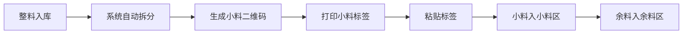
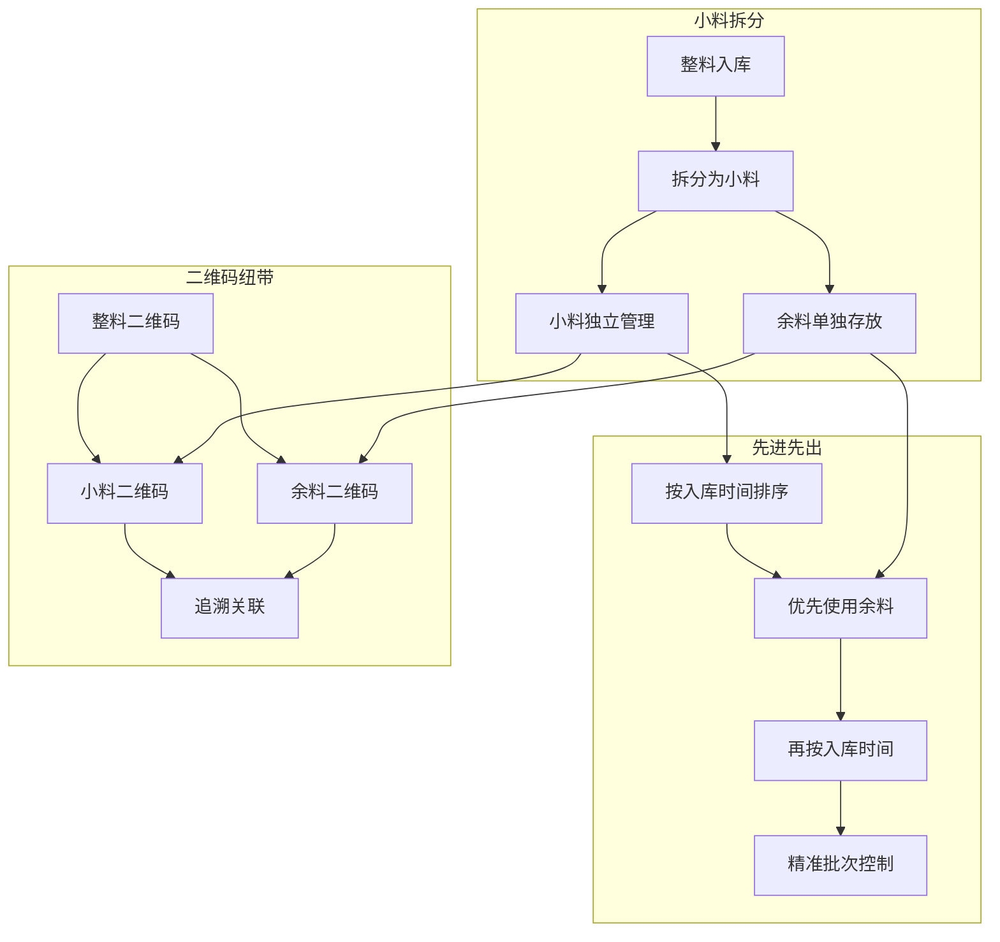

# 仓库管理核心原则专项说明

> 文档编号：VNERP-DESIGN-026  
> 版本：V1.0  
> 更新日期：2026-05-10

---

## 1. 先进先出 (FIFO) 原则实施细则

### 1.1 实施目标

- 确保所有原材料严格按照入库顺序领用
- 减少因物料过期造成的浪费
- 提高产品质量的一致性
- 实现质量问题的精准追溯

### 1.2 系统保障措施

| 保障措施 | 实现方式 | 系统强制 |
|----------|----------|----------|
| 自动批次推荐算法 | 系统根据入库时间+效期自动推荐最早批次 | 是 |
| 禁止手动选择批次 | 出库时必须使用系统推荐批次 | 是（可通过异常申请覆盖） |
| 异常领用审批机制 | 非FIFO领用必须记录并审批 | 是 |
| 效期预警和超期冻结 | 提前30天预警，超期自动冻结 | 是 |
| 批次隔离库位管理 | 不同批次分区存放 | 推荐 |
| 完整的操作日志记录 | 所有操作记录到 inv_fifo_override_log | 是 |

### 1.3 管理要求

1. **仓库人员必须严格按照系统推荐的批次进行发料**
2. **确需领用非推荐批次的，必须提交书面申请并经仓库主管审批**
3. **定期检查库存物料的效期，及时处理即将过期的物料**
4. **每月进行一次先进先出执行情况的检查和评估**

### 1.4 FIFO算法实现

```typescript
// 伪代码示例
function allocateFIFO(materialId: number, quantity: number) {
  // 1. 查询可用库存（按入库时间排序）
  const batches = queryAvailableBatches(materialId);
  
  // 2. 优先选择余料（split_flag=2）
  const remainderBatches = batches.filter(b => b.split_flag === 2);
  
  // 3. 再按入库时间排序
  const sortedBatches = [...remainderBatches, ...batches.filter(b => b.split_flag !== 2)]
    .sort((a, b) => a.inbound_date - b.inbound_date);
  
  // 4. 分配批次
  const allocation = [];
  let remainingQty = quantity;
  
  for (const batch of sortedBatches) {
    if (remainingQty <= 0) break;
    const qty = Math.min(remainingQty, batch.remaining_quantity);
    allocation.push({ batch_no: batch.batch_no, quantity: qty });
    remainingQty -= qty;
  }
  
  return allocation;
}
```

---

## 2. 小料拆分原则实施细则

### 2.1 实施背景

丝网印刷行业的原材料大多以大包装采购（如整卷薄膜、整桶油墨），但生产时需要按小单位领用。传统的整包领用方式会导致：

- 物料浪费严重
- 批次管理混乱
- 无法精确核算成本
- 先进先出难以执行

### 2.2 标准拆分单位配置

| 物料类别 | 标准采购单位 | 标准拆分单位 | 备注 |
|----------|--------------|--------------|------|
| PET 薄膜 | 100 米 / 卷 | 10 米 / 小卷 | 不足 10 米的作为余料 |
| PVC 薄膜 | 100 米 / 卷 | 10 米 / 小卷 | 不足 10 米的作为余料 |
| 油墨 | 5kg / 桶 | 1kg / 小桶 | 不足 1kg 的作为余料 |
| 溶剂 | 20L / 桶 | 5L / 小桶 | 不足 5L 的作为余料 |
| 网布 | 50 米 / 卷 | 10 米 / 小卷 | 不足 10 米的作为余料 |

### 2.3 拆分操作规范

1. **整料入库后必须立即进行拆分，不得直接领用整料**
2. **拆分时必须准确称量或测量小料数量**
3. **每个小料单元必须粘贴独立的二维码标签**
4. **拆分后的整料必须存放在整料区，禁止存放在小料区**
5. **余料必须单独存放并生成余料二维码，优先领用**

### 2.4 拆分流程



### 2.5 成本核算影响

- 小料拆分过程中的损耗计入物料成本
- 系统自动按小料单位核算工单物料成本
- 余料成本自动分摊到后续领用的工单中

---

## 3. 两个原则的协同关系

### 3.1 协同关系图



### 3.2 协同关系说明

| 关系 | 说明 |
|------|------|
| 小料拆分是实现先进先出的基础 | 只有将整料拆分为小料单元，才能精确控制每个批次的领用顺序 |
| 先进先出是小料拆分的目的 | 通过小料拆分实现精确的批次管理，从而严格执行先进先出原则 |
| 二维码是连接两个原则的纽带 | 每个小料单元都有唯一的二维码，既实现了小料的独立管理，又实现了批次的精确追溯 |

---

## 4. 系统强制保障机制

### 4.1 整料锁定机制

```typescript
// 出库时检查是否为整料
function checkMaterialSplitFlag(qrCode: string) {
  const qrInfo = getQRCodeInfo(qrCode);
  
  if (qrInfo.split_flag === 0) {
    throw new Error('整料禁止直接领用，请先拆分小料');
  }
  
  return true;
}
```

### 4.2 FIFO强制机制

```typescript
// 出库时强制校验FIFO
function enforceFIFO(materialId: number, batchNo: string) {
  const recommendedBatches = allocateFIFO(materialId, 1);
  const recommendedBatchNo = recommendedBatches[0]?.batch_no;
  
  if (batchNo !== recommendedBatchNo) {
    // 记录异常并需要审批
    logFIFOOverride(materialId, recommendedBatchNo, batchNo);
    throw new Error('非FIFO批次，请提交异常领用申请');
  }
  
  return true;
}
```

### 4.3 余料优先机制

```sql
-- FIFO查询时余料优先
SELECT * FROM inv_inventory_batch b
LEFT JOIN qr_codes q ON b.batch_no = q.batch_no
WHERE b.material_id = ? AND b.remaining_quantity > 0
ORDER BY 
  CASE WHEN q.split_flag = 2 THEN 0 ELSE 1 END ASC,  -- 余料优先
  b.expire_date ASC,  -- 再按效期
  b.inbound_date ASC,  -- 再按入库时间
  b.id ASC;
```

---

## 5. 操作流程规范

### 5.1 入库流程

1. 采购订单审核通过
2. 整料到货，生成整料二维码（split_flag=0）
3. 扫码整料入库
4. 系统自动拆分小料（split_flag=1）和余料（split_flag=2）
5. 打印小料和余料标签
6. 小料入小料区，余料入余料区

### 5.2 出库流程

1. 工单下发，自动生成领料单
2. 系统FIFO推荐小料批次（优先余料）
3. 仓库人员按推荐批次备货
4. 扫描小料二维码出库
5. 系统校验是否为推荐批次
6. 扣减库存，生成追溯记录

### 5.3 盘点流程

1. 生成盘点单，锁定库存
2. 扫描小料二维码盘点
3. 系统自动识别整料关联
4. 小料汇总与整料库存对比
5. 差异审批后调整库存

---

## 6. 异常处理

| 异常场景 | 处理方式 |
|----------|----------|
| 整料未拆分 | 系统禁止出库，提示"请先拆分小料" |
| 小料库存不足 | 系统提示并生成整料拆分任务 |
| 非FIFO批次出库 | 系统禁止出库，需提交异常申请 |
| 余料未优先使用 | 系统提示"有余料批次，建议优先使用" |
| 拆分数量不准确 | 系统记录差异，影响成本核算 |
| 标签脱落 | 通过批次号查询重新打印标签 |

---

## 7. 监控与报表

### 7.1 监控指标

| 指标 | 说明 | 目标值 |
|------|------|--------|
| FIFO执行率 | 按FIFO批次出库的比例 | ≥95% |
| 整料直接领用率 | 未拆分直接领用整料的比例 | ≤1% |
| 余料使用率 | 余料被优先使用的比例 | ≥90% |
| 批次追溯成功率 | 能完整追溯到批次的比例 | ≥99% |

### 7.2 报表

- **FIFO执行情况报表**：统计各仓库的FIFO执行情况
- **小料拆分统计报表**：统计各物料的拆分情况
- **余料使用分析报表**：分析余料的使用率和成本节约
- **批次追溯报表**：统计批次追溯的成功率和效率
